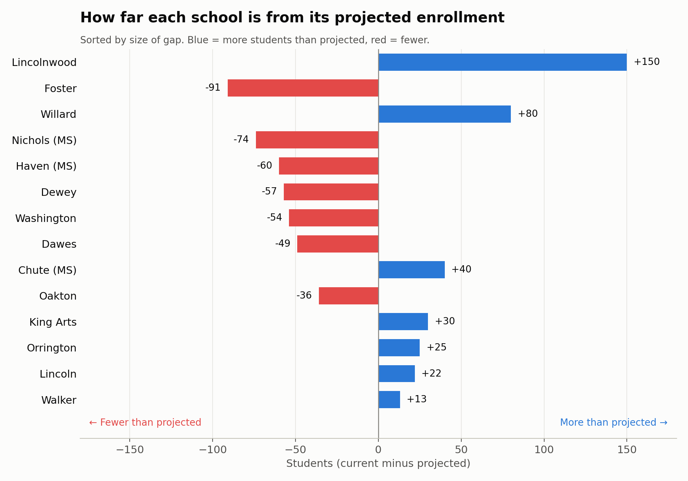
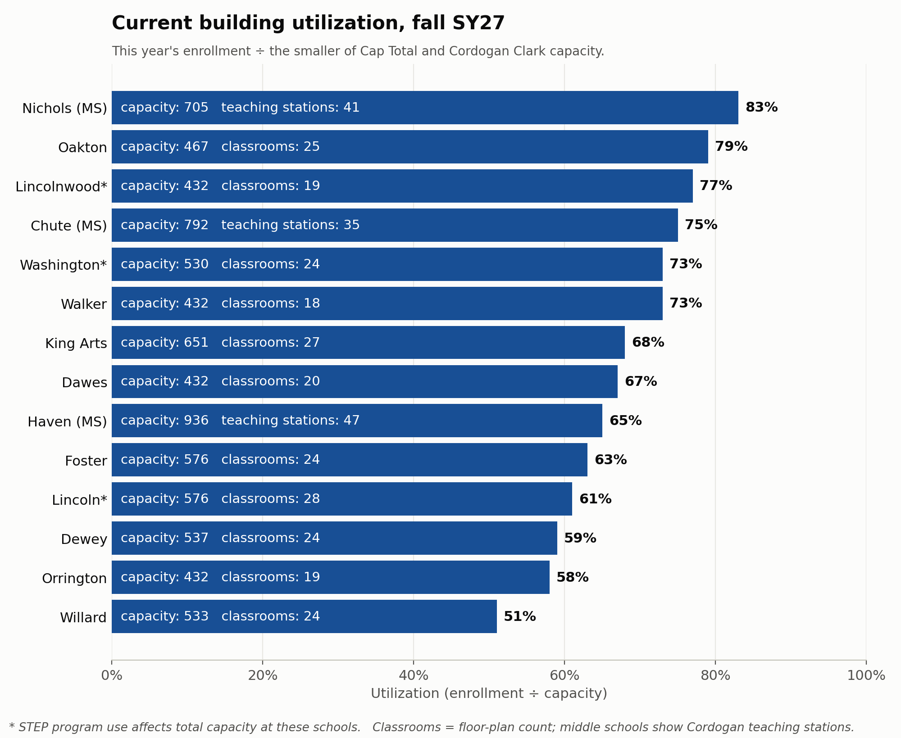
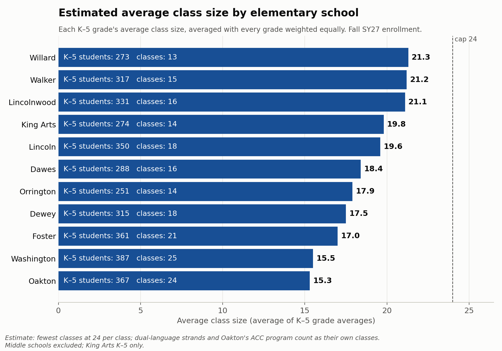
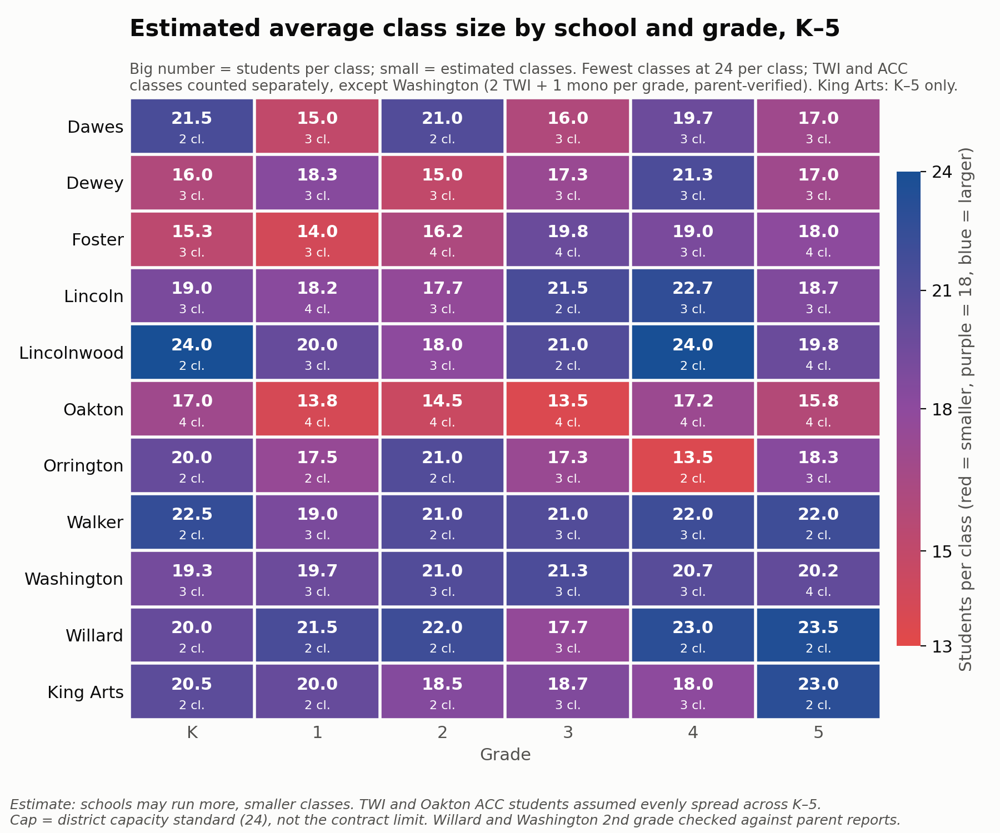

# D65 building use analysis

An analysis of how Evanston/Skokie School District 65 buildings are used: enrollment against projections, utilization and capacity, class sizes, dual-language (TWI) strands, attendance-area capture, building space and utility cost.

- **Current data:** the district's public dashboard, [data.district65.net](https://data.district65.net), pulled 2026-09-23 (fall of school year 2026–27, "SY27").
  - **HELP WITH ACCURACY** [crowdsourcing-file here](https://docs.google.com/forms/d/e/1FAIpQLSepZPKRXOA8HTbEoWf8sUmXK_UlhWkK4_6y4cl9NQLNEYL1Bw/viewform?usp=dialog) Complete this form if you have data on schools and class sizes
- **Planning data:** two district utilization/capacity tables, transcribed from screenshots, and Cordogan Clark's February 2022 capacity report (PDF), which verifies the screenshots. See `sources/`.
- **Everything is in one notebook:** `d65_enrollment_by_building.ipynb`. Run it top to bottom to rebuild every table in `data/` and every chart in `images/`.
> **AI assistance:** This analysis was built with help from Claude, Anthropic's AI assistant. Claude can make mistakes, including in transcribing data, in calculations and in interpretation. Please verify figures against the original sources in `sources/` before relying on them.

## Key findings

### 1. Enrollment compared with projections: big gaps in how schools enrolled relative to predictions from last year



Each bar is a school's fall SY27 enrollment minus the district's projection. Schools are sorted by the size of the gap. Blue means more students than projected; red means fewer.

- **Seven schools came in below projection.** Foster (−91), Nichols (−74), Haven (−60), Dewey (−57), Washington (−54), Dawes (−49) and Oakton (−36). Five of the seven host dual-language (TWI) programs.
- **Seven came in above.** Lincolnwood (+150), Willard (+80), Chute (+40), King Arts (+30), Orrington (+25), Lincoln (+22) and Walker (+13).
- **Across all 14 schools**, enrollment is 5,462 against 5,523 projected (−61, about 1%). The gaps mostly offset each other, so the issue is where students are, not how many.
- **Two projections come from a scenario that kept Kingsley open.** Lincolnwood's and Willard's projections (181 and 193) are from the Cordogan Clark capacity table. The 1A table projects 280 and 261, which would shrink their gaps to +51 and +12.

### 2. Building utilization only shows one piece of the puzzle



Utilization = fall SY27 enrollment ÷ capacity. Capacity is the smaller of the district's Cap Total (1A table) and Cordogan Clark's capacity (verified against their February 2022 report). Each bar shows the capacity used and the school's classroom count; middle schools show teaching stations instead.

- **Utilization ranges from 51% (Willard) to 83% (Nichols).**
- **STEP (\*)** program use affects capacity at Lincoln, Lincolnwood and Washington.

### 3. Average class size by elementary school does not necessarily correlate with utilization



The estimated average class size for each elementary school (King Arts K–5 only), averaged across K–5 with every grade weighted equally. Class counts are **estimated** because the dashboard reports enrollment by grade, not by class:

- **Monolingual/mainstream classes:** the fewest classes that keep each class at 24 or fewer students.
- **Dual-language schools:** one class per strand at each grade.
- **Oakton:** one African-Centered Curriculum (ACC) class per grade.
- **Washington:** parents report one monolingual/mainstream class alongside the two TWI classes, so Washington's TWI and monolingual/mainstream students share the 24-student cap (2 TWI + 1 monolingual/mainstream class per grade, 4 classes in 5th grade). See the parent check below.

- **Estimated averages run from 21.3 (Willard) down to 15.3 (Oakton).**
- **Willard, Walker and Lincolnwood have the largest classes**, averaging about 21. Washington (20.4) is close behind now that it uses the parent-reported class structure.

**Class size by school and grade.** The same estimates grade by grade: red cells are the smallest classes, purple is about 18 students, and blue is the largest (up to the 24-student cap). The small number in each cell is the estimated number of classes.



- **Oakton** is red in every grade (13.5–17.2), partly because its ACC and TWI classes are counted separately.
- **Dewey, Dawes, Foster and Orrington** each have three or four grades under 18.
- **Walker, Washington, Willard and Lincolnwood** are mostly 20 or more.

## Class-size math by school

Students in the grade ÷ estimated classes = average class size (fall SY27, elementary, King Arts K–5 only).

| School | K | 1 | 2 | 3 | 4 | 5 | Avg | Program classes per grade |
|---|---:|---:|---:|---:|---:|---:|---:|---|
| Willard | 40 ÷ 2 = **20.0** | 43 ÷ 2 = **21.5** | 44 ÷ 2 = **22.0** | 53 ÷ 3 = **17.7** | 46 ÷ 2 = **23.0** | 47 ÷ 2 = **23.5** | **21.3** | – |
| Walker | 45 ÷ 2 = **22.5** | 57 ÷ 3 = **19.0** | 42 ÷ 2 = **21.0** | 63 ÷ 3 = **21.0** | 66 ÷ 3 = **22.0** | 44 ÷ 2 = **22.0** | **21.2** | – |
| Lincolnwood | 48 ÷ 2 = **24.0** | 60 ÷ 3 = **20.0** | 54 ÷ 3 = **18.0** | 42 ÷ 2 = **21.0** | 48 ÷ 2 = **24.0** | 79 ÷ 4 = **19.8** | **21.1** | – |
| Washington | 58 ÷ 3 = **19.3** | 59 ÷ 3 = **19.7** | 63 ÷ 3 = **21.0** | 64 ÷ 3 = **21.3** | 62 ÷ 3 = **20.7** | 81 ÷ 4 = **20.2** | **20.4** | 2 TWI (+1 mono, parent-verified) |
| King Arts | 41 ÷ 2 = **20.5** | 40 ÷ 2 = **20.0** | 37 ÷ 2 = **18.5** | 56 ÷ 3 = **18.7** | 54 ÷ 3 = **18.0** | 46 ÷ 2 = **23.0** | **19.8** | – |
| Lincoln | 57 ÷ 3 = **19.0** | 73 ÷ 4 = **18.2** | 53 ÷ 3 = **17.7** | 43 ÷ 2 = **21.5** | 68 ÷ 3 = **22.7** | 56 ÷ 3 = **18.7** | **19.6** | – |
| Dawes | 43 ÷ 2 = **21.5** | 45 ÷ 3 = **15.0** | 42 ÷ 2 = **21.0** | 48 ÷ 3 = **16.0** | 59 ÷ 3 = **19.7** | 51 ÷ 3 = **17.0** | **18.4** | 1 TWI |
| Orrington | 40 ÷ 2 = **20.0** | 35 ÷ 2 = **17.5** | 42 ÷ 2 = **21.0** | 52 ÷ 3 = **17.3** | 27 ÷ 2 = **13.5** | 55 ÷ 3 = **18.3** | **17.9** | – |
| Dewey | 48 ÷ 3 = **16.0** | 55 ÷ 3 = **18.3** | 45 ÷ 3 = **15.0** | 52 ÷ 3 = **17.3** | 64 ÷ 3 = **21.3** | 51 ÷ 3 = **17.0** | **17.5** | 1 TWI |
| Foster | 46 ÷ 3 = **15.3** | 42 ÷ 3 = **14.0** | 65 ÷ 4 = **16.2** | 79 ÷ 4 = **19.8** | 57 ÷ 3 = **19.0** | 72 ÷ 4 = **18.0** | **17.0** | 2 TWI |
| Oakton | 68 ÷ 4 = **17.0** | 55 ÷ 4 = **13.8** | 58 ÷ 4 = **14.5** | 54 ÷ 4 = **13.5** | 69 ÷ 4 = **17.2** | 63 ÷ 4 = **15.8** | **15.3** | 1 TWI + 1 ACC |

*Each cell shows students in that grade ÷ estimated classes = average class size. "Avg" is the average of the six grade averages. "Program classes per grade" lists the dual-language (TWI) and ACC classes included in each grade's count. The rest are monolingual/mainstream classes. For example, Foster kindergarten = 2 TWI + 1 monolingual/mainstream = 3 classes. Monolingual/mainstream classes are the fewest that keep each class at 24 or fewer students. TWI and ACC students are assumed evenly spread across K–5, and Oakton ACC uses the 73 projected students. These are estimates, not reported class counts. Full detail: `data/class_size_detail_by_school.csv`.*

**Checked against parent reports (as of 2026-09-24).** Parents reported 11 actual classes through the [crowdsourcing form](https://docs.google.com/forms/d/e/1FAIpQLSepZPKRXOA8HTbEoWf8sUmXK_UlhWkK4_6y4cl9NQLNEYL1Bw/viewform?usp=dialog). Ten were reported with confidence 4–5 out of 5 and a named source (the teacher, a conference, a class email list, the PTA or a child in the class). These are still second-hand reports, not district data. Notebook section 12 compares each report with the estimate above.

| School | Grades reported | Classes reported | Result |
|---|---|---:|---|
| Willard | K, 1, 2, 3, 4, 5 | 8 | **All 8 match the estimate within 2 students.** In grades 1 and 2 every class was reported: 1st grade 22 + 21 = 43, the same as the dashboard's 43. 2nd grade 22 + 21 = 43, against 44 on the dashboard (one parent gave a grade total of 42). |
| Washington | 2, 5 | 3 | **2nd grade now matches; 5th grade is 3 above.** 2nd grade: a monolingual/mainstream class of 23 and a TWI class of 19. The original estimate was about 15 and 16, because it assumed 2 monolingual/mainstream classes per grade. Parents report only one, so the estimates now use **2 TWI + 1 monolingual/mainstream class per grade** at Washington (21.0 per class in 2nd grade, within 2 of both reports). 5th grade (81 students) is departmental, with reported classes of 23 against our estimate of 20.2 (4 classes). |

**Still unverified:** every other school, and Washington's K, 1, 3 and 4. Treat those class sizes as estimates. Washington's structure (2 TWI + 1 monolingual/mainstream) is applied to all of its K–5 grades on the strength of the 2nd-grade reports. **Foster** also has two TWI strands and may be organized the same way; if so, its classes are larger than estimated here. It stays on the separate-classes estimate until parents report. Files: `data/parent_reported_class_sizes.csv` (every form response), `data/class_size_parent_check.csv` (one row per class, compared with the estimate) and `data/class_size_parent_check_by_grade.csv` (reported classes against dashboard enrollment by grade).


## How the data was collected

- **Current data** comes from the district's public dashboard, [data.district65.net](https://data.district65.net), a Plotly Dash app. Its charts come from requests to `/_dash-update-component`.
- **The pull (2026-09-23):** those same requests were made for the district as a whole and for each of the 14 schools (Home, Attendance, Discipline, and all five assessments), plus every building's utility data. The chart data was decoded into the tidy CSVs in `data/`.
- **Checks:** every school had to add up to the district totals. The dashboard's filter is shared between visitors, so each school was also checked for internal consistency.
- **Planning data** comes from two district tables (typed in from screenshots) and Cordogan Clark's February 2022 capacity report (PDF). See `sources/sources.md`.

Full replication details, the endpoints and the scraper are in **[`scraping/README.md`](scraping/README.md)**.

## Folder layout

```
d65-dashboard-data/
├── README.md                     this file
├── d65_enrollment_by_building.ipynb  analysis notebook (reads data/, writes data/ and images/)
├── scraping/                     d65_scrape.py (re-pulls the dashboard into data/) and replication notes
├── requirements.txt              Python packages needed
├── data/                         all CSVs: inputs and the tables the notebook writes
├── images/                       all charts (PNG)
└── sources/                      sources.md, the Cordogan Clark report (PDF) and the original screenshots
```

## How to refresh

1. `pip install -r requirements.txt`
2. `python3 scraping/d65_scrape.py` pulls the dashboard again and overwrites the dashboard CSVs in `data/` (the first seven input files below). See `scraping/README.md`.
3. Re-run the notebook top to bottom. It needs only four inputs (`students_home_demographics.csv`, `sustainability_utility.csv`, `utilization_1A_website.csv`, `capacity_cordogan_clark.csv`) and rebuilds every other table and chart. The two transcribed tables don't change unless you edit them.

The dashboard stores filtered results in one shared spot on its server, so another visitor filtering at the same moment can mix up numbers. The script re-runs any school whose totals don't add up, and checks that schools sum to the district.

## Data files (`data/`)

### Inputs

| File | Source | Contents |
|---|---|---|
| `students_home_demographics.csv` | Dashboard | Home page by school: enrollment, grade, IEP, EL, TWI (TWE/TWS/TWX), race/ethnicity, incident levels |
| `students_attendance.csv` | Dashboard | Average daily attendance, chronic absenteeism, attendance-rate distribution (10-pt bins) by school |
| `students_discipline.csv` | Dashboard | Incidents by level, month, race/ethnicity, grade and school |
| `students_assessments.csv` | Dashboard | STAR Reading and Early Literacy (English and Spanish), i-Ready Math: benchmark categories, percentile and growth distributions (10-pt bins), by school |
| `sustainability_utility.csv` | Dashboard | Utility use (electric, gas), carbon, cost, energy use per sq ft (EUI) and savings, 2018–2026, district ("All") and 18 buildings |
| `d65_dashboard_all_long.csv` | Dashboard | All of the above in one long table |
| `school_summary.csv` | Dashboard | One row per school plus District: enrollment, attendance, chronic absenteeism, IEP/EL counts and %, incidents |
| `utilization_1A_website.csv` | Screenshot, district "1A_Utilization_website" | Per school: SY25 enrollment, area counts, capacity (total, neighborhood, TWI, ACC), **projected** enrollment by program, projected utilization |
| `cordogan_clark_2022_report.csv` | Cordogan Clark report (PDF, Feb 2022) | Every building's summary page: core classroom + SPED sq ft (and science labs), teaching stations, capacity, sq ft per student, 2021–22 enrollment and utilization, capacity goal, PDF page |
| `capacity_cordogan_clark.csv` | Screenshot, capacity table with Cordogan Clark counts | Elementary schools + King Arts: Cap Total, teaching stations, projected enrollment, classroom square feet, Cordogan Clark capacity, floor-plan classrooms, offices, other rooms, comments |

Dashboard files are long/tidy: `school` (or `account`), `chart_id`, `chart_title`, `series`, `category`, `value`.

### Outputs written by the notebook

**Enrollment**

| File | Contents |
|---|---|
| `enrollment_by_school_grade.csv` | Current enrollment by school and grade (K = grade_0) with totals |
| `enrollment_vs_utilization.csv` | Current vs. projected enrollment (1A table) and SY25, with differences |

**Capacity and utilization**

| File | Contents |
|---|---|
| `utilization_current_vs_predicted.csv` | Predicted vs. current utilization, the capacity used and its source |
| `capacity_comparison.csv` | Every capacity figure per school: district and Cordogan teaching stations, floor-plan classrooms, Cap Total, Cordogan capacity, 24 × classrooms, capacity used and source |
| `building_square_feet.csv` | Estimated square feet per building (derived from energy data; see Methods) |

**Class size (estimated)**

| File | Contents |
|---|---|
| `class_size_detail_by_school.csv` | **Main class-size file.** Every input and step per school and grade: students, cap, estimated TWI and ACC students and classes, monolingual/mainstream students and classes, class sizes |
| `table_students_by_school_grade.csv` | Supporting table 1: students by school and grade (integers, with totals) |
| `table_classes_by_school_grade.csv` | Supporting table 2: estimated classes by school and grade (integers, with totals) |
| `class_size_by_school_overall.csv` | Elementary only (King Arts K–5): average of K–5 grade averages, and the student-weighted average |
| `parent_reported_class_sizes.csv` | Class sizes reported by parents through the crowdsourcing form, one row per response (timestamp, school, grade, program, teacher, class size, grade total if given, confidence 1–5, source) |
| `class_size_parent_check.csv` | One row per reported class (duplicate reports combined), with our estimate for the same school, grade and program, the difference, and Consistent (within 2) or Differs |
| `class_size_parent_check_by_grade.csv` | By school and grade: classes reported, sum of reported sizes, dashboard enrollment, estimated classes |
| `classrooms_needed_vs_available.csv` | Estimated classes vs. the district's floor-plan classroom count, with spare rooms (upper bound) |
| `table_enrollment_twi_by_school_grade.csv` | Elementary enrollment by grade with TWI (and Oakton ACC) breakouts and strands; estimates are whole students that add up to real totals |

**Programs, neighborhood and cost**

| File | Contents |
|---|---|
| `twi_strands.csv` | Dual-language strands: current TWE/TWS/TWX, capacity, strands, rooms, % full, students per room, Spanish-dominant share, projection |
| `attendance_area_capture.csv` | Students living in each attendance area vs. enrolled, total and neighborhood-only capture % |
| `utility_cost_per_student.csv` | 2025 utility cost per building, enrollment, capacity, empty seats, cost per student, cost per seat, cost matching empty seats |

## Charts (`images/`)

| Chart | Shows |
|---|---|
| `chart_projected_vs_current_enrollment.png` | Projected vs. current enrollment by school, with totals and gaps |
| `chart_enrollment_difference.png` | Current minus projected, largest gap first |
| `chart_utilization_predicted_vs_current.png` | Predicted vs. current utilization, gap in points |
| `chart_utilization_current.png` | Current utilization, with capacity and classrooms in each bar |
| `chart_learning_space_share.png` | Classroom square feet as a share of the building |
| `chart_attendance_area_capture.png` | Students living in each area vs. enrolled |
| `chart_utility_cost_per_student.png` | 2025 utility cost per enrolled student |
| `chart_utility_cost_per_seat.png` | 2025 utility cost per seat of capacity |
| `chart_class_size_heatmap.png` | Estimated class size, every elementary school and grade K–5 (King Arts K–5 only) |
| `chart_class_size_by_grade.png` | District average class size by grade, K–8 |
| `chart_class_size_by_school.png` | One panel per school: class size by grade, with students ÷ classes |
| `chart_class_size_elementary_by_grade.png` | Elementary schools, one panel each: class size in each K–5 grade, with students ÷ classes and the TWI/ACC/monolingual-mainstream class mix written in each bar |
| `chart_class_size_by_school_overall.png` | Elementary schools, one average class size each |
| `table_enrollment_twi_by_school_grade.png` | Table: elementary enrollment by grade with TWI/ACC breakouts and strands |

## Notebook outline

0. Setup (libraries, chart style, helpers)
1. Enrollment by school and grade, checked against district totals
2. Projected vs. current enrollment (1A utilization table)
3. Validation of the screenshot against the Cordogan Clark report, then current utilization with Cordogan Clark capacity
4. Enrollment and utilization charts
5. Capacity comparison
6. Building square footage and learning space
7. Attendance-area capture
8. Utility cost per student and per seat
9. Dual-language (TWI) strands
10. Estimated classes and class size: by grade, by school, supporting tables, elementary summaries
11. Enrollment table with TWI breakouts
12. Parent-reported class sizes compared with the estimates

## Methods and definitions

| Term | Definition |
|---|---|
| **Current enrollment** | Dashboard enrollment, fall SY27 |
| **Projected enrollment** | "Enroll Total" in the district tables, a district projection. The elementary projections come from the Cordogan table; Chute, Haven and Nichols from the 1A table |
| **Cap Total** | District baseline capacity = 24 × calculated teaching stations |
| **Capacity used** | The smaller of Cap Total and Cordogan Clark capacity. Middle schools' Cordogan capacity comes from the report (PDF); their Cap Total and projections come from the 1A table |
| **Capacity goal** | Cordogan Clark's target utilization: 85% elementary, 80% middle, 75% Park/Rhodes/King Arts, 90% JEH (in `cordogan_clark_2022_report.csv`) |
| **Utilization** | Enrollment ÷ capacity used. Predicted utilization = projected enrollment ÷ Cap Total, as the district computed it |
| **STEP (\*)** | STEP program use affects total capacity at Lincoln, Lincolnwood and Washington |
| **Classrooms** | The district's floor-plan classroom count (capacity screenshot). Foster uses its teaching-station count because its floor-plan figure is blank. Middle schools have no floor-plan count; charts show their Cordogan teaching stations |
| **Building square feet** | (Electric + gas MMBtu) × 1,000 ÷ EUI (kBtu per sq ft), using 2025. 2018 gives the same result within about 25 sq ft. Accurate to roughly ± a few hundred sq ft |
| **Learning space** | Cordogan "Total SF Core Classrooms + SPED" (plus science labs at middle schools) ÷ building square feet |
| **Area capture** | Current enrollment ÷ students living in the attendance area ("Area Counts"). The neighborhood version subtracts TWI students, so it undercounts at TWI schools, since some TWI students live nearby |
| **Utility cost** | Electric, gas and water, calendar 2025, the last full year. Cost per student uses fall SY27 enrollment |
| **TWI strand** | One dual-language class per grade K–5 (6 rooms, 144 seats). TWE/TWS = English/Spanish-dominant; TWX as labeled by the district (meaning not confirmed) |

### Class-size estimate

The dashboard has enrollment by grade, not how many classes each grade has, so classes are **estimated**:

- **Monolingual/mainstream classes:** the fewest classes that keep each class at or under the cap, `ceil(students ÷ 24)`. This gives the fewest classrooms and largest average class a grade could have. Real schools may run more, smaller classes.
- **Cap = 24:** the district's capacity standard, not the teacher-contract limit. Change `CAP` in the notebook to use grade-level limits.
- **TWI schools (Dawes, Dewey, Foster, Oakton, Washington), K–5:** one class per strand per grade. TWI students are assumed spread evenly across K–5.
- **Washington (parent-verified):** TWI and monolingual/mainstream students share the cap: the fewest classes at 24 or fewer, with at least 2 TWI + 1 monolingual/mainstream. Students are spread evenly across the classes.
- **Oakton ACC:** one ACC (African-Centered Curriculum) class per grade K–5. The dashboard doesn't identify ACC students, so the 1A table's projected 73 are spread evenly (~12 per grade) and taken out of Oakton's monolingual/mainstream classes. Change `acc_total` in the notebook if you have the actual count.
- **Middle schools:** sections of up to 24 students, since there are no homerooms. They're excluded from the elementary summaries, and King Arts counts K–5 only there.

## Checks

- School enrollments, IEP counts and incidents add up to district totals (5,462 / 953 / 968).
- Every grade's school enrollments add up to the district total for that grade.
- Transcribed tables: parts add up to Enroll Total, and every Util % and Cordogan Delta recomputes.
- The capacity screenshot's Cordogan figures (square feet, teaching stations, capacity) match Cordogan Clark's February 2022 report for all 11 schools it covers. The notebook asserts this on every run.
- Transcriptions were checked byte for byte (checksums) when moving the dashboard data.

## Known limitations and data to request

- **Class counts are estimates.** Actual sections by school and grade would replace them.
- **TWI by grade:** needed to model the dual-language scenarios room by room.
- **Current ACC enrollment at Oakton:** the model uses the 73 projected.
- **Middle schools:** the Cordogan report gives their teaching stations, capacity and classroom square feet, but there's no floor-plan classroom count, so they're left out of the classrooms-needed comparison.
- **Foster:** has no utility account on the dashboard, so there's no square footage or cost for it.
- **Classroom counts** may include art, music or library rooms, so spare-room figures are upper bounds.
- **The dashboard's shared filter** can cross results between visitors; see How to refresh.
- **`scraping/d65_scrape.py` hasn't been run end to end against the live site.** The first pull went through a browser, and the script's chart-decoding code was tested against real responses. Expect small fixes on its first run.

See `sources/sources.md` for where each number comes from.

