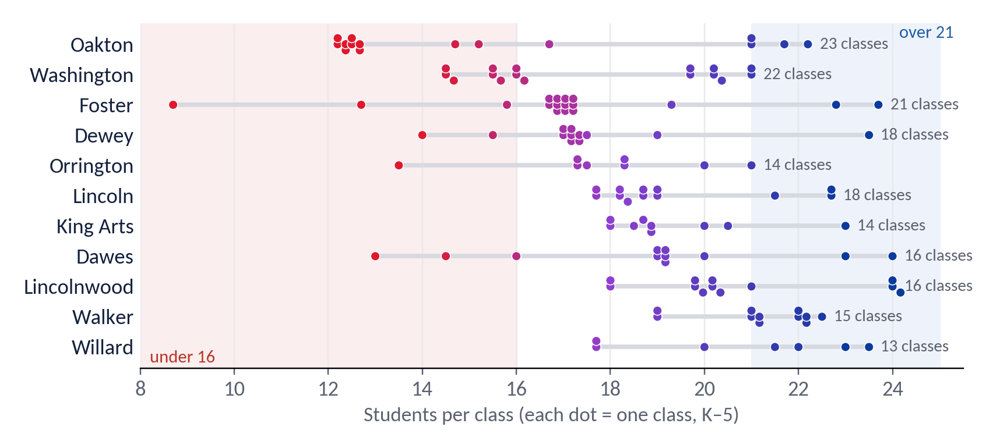
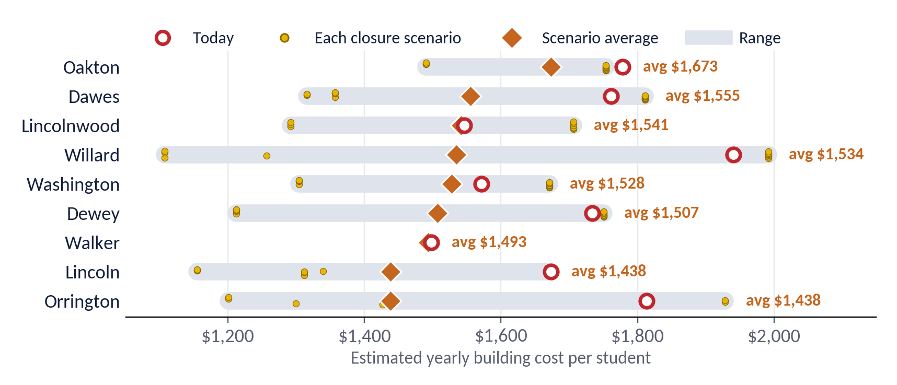
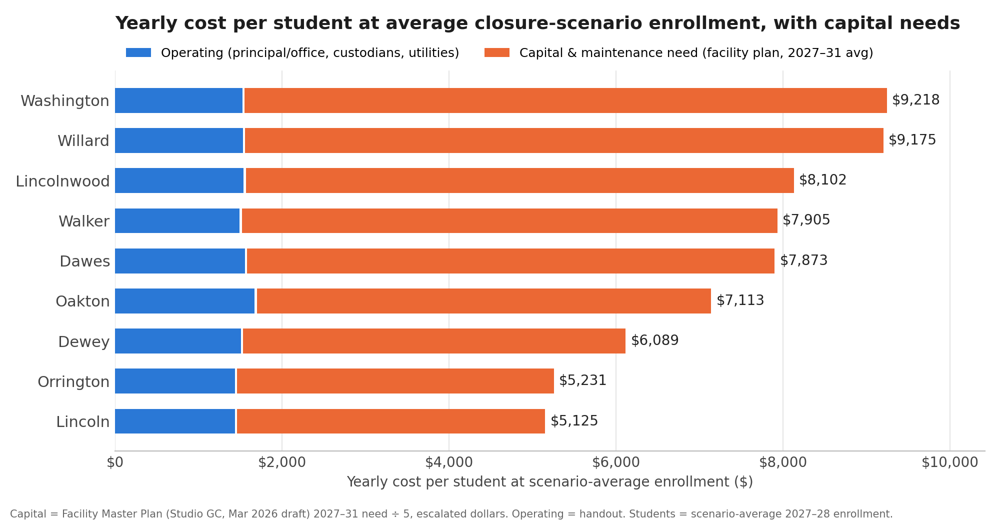
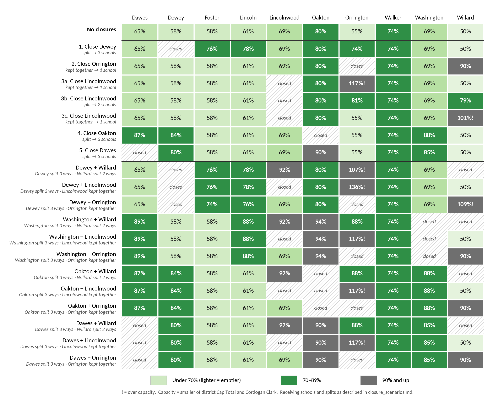
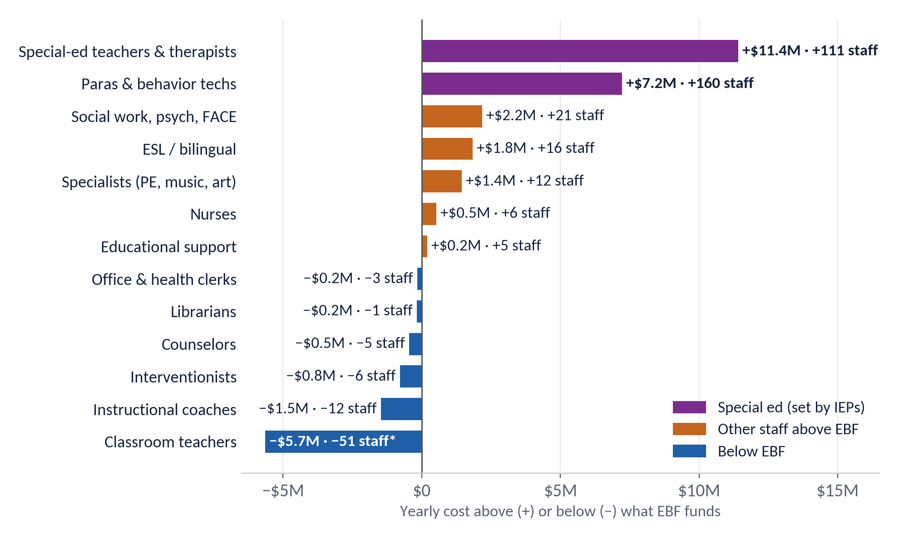
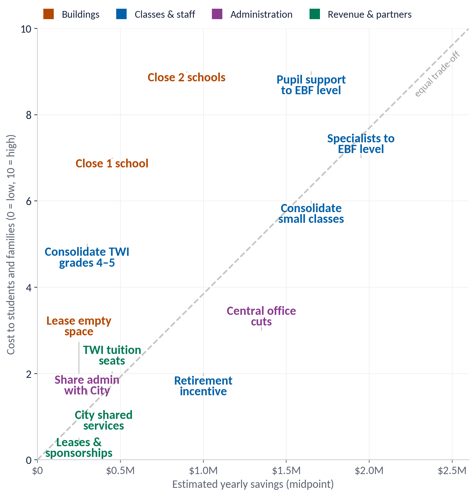
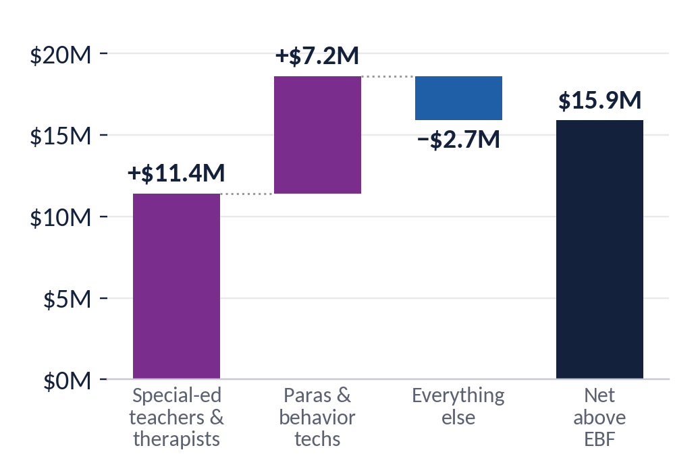

# School closure scenarios: what to weigh before deciding

*Legion of Data Nerds · Budget brief · Fall 2026*

District 65 needs to cut about 10% of its budget. We looked at class sizes, the options on the table, our staffing against the State's funding model, building costs and the closure scenarios.

> **About this version.** This is a text version of `d65_budget_choices_handout.pdf`. It adds three things, each marked **Added**:
>
> 1. The facility plan's capital needs, folded into the building-cost comparison (section 01)
> 2. Closing Dawes, as a single closure and in pairs (section 02)
> 3. A check of the handout's classroom counts against the District's March 2026 Facility Master Plan (appendix)

## What should guide the plan

1. **Decide by outcomes, not dollars.** Orient decisions and accountability toward what students learn, and judge every cut by its effect on the classroom.
2. **Build a learning organization.** Use data to improve, and be willing to say when something didn't work and change course.
3. **Engaged families are an asset.** Community groups like ours are part of a healthy district. When parents check out, the system has already failed.

## Risk assessment: a building-first plan

| Risk | Level | What we found |
|---|---|---|
| Enrollment numbers are off | **High** | May projection: 604 kindergartners; fall actual: 534 (−12%). About 210 students attend by permissive transfer. |
| Receiving schools overfill | **High** | **8 of 19** scenarios push a school past capacity (7 of 15 before Dawes was added). |
| Low-enrollment programs | **High** | Closing TWI, ACC or STEP buildings means moving whole programs. |
| One-time costs and special ed | **High** | Costs come before savings; IEP services must continue uninterrupted. |
| A two-tier system | **High** | Families who can afford it opt for private school, leaving D65 with fewer resources and less engaged support. |
| Transportation costs | Medium | $150–270K a year per closure, 20–35% of building savings. |
| Equity | Medium | Closures land on specific neighborhoods and TWI access. |
| Attention is finite | Medium | Closure planning takes time that staffing decisions need. |

## Class size and the student experience

### A child's class size depends on their school and grade

- **Classes run from about 12 to 24 students.** Of 190 estimated K–5 classes, 36 have under 16 and 37 have over 21.
- **Same grade, different school.** A 3rd grader at Oakton is in a class of 12–15; at Lincoln, about 21–22.
- **Fuller buildings don't have bigger classes** (r = −0.11). The spread comes from how grades divide into classes and from TWI and ACC strands.

---

## 01 · Building costs: which buildings cost the most to run?

Every building carries a principal, an office and custodians whatever its size, so emptier buildings cost more per student. At the average closure-scenario enrollment, Oakton, Dawes and Lincolnwood cost the most per student; Lincoln and Orrington the least.

| Building | Students | Utilization now → avg* | Principal + office | Custodians | Utilities | Total a year | Per student now | Per student, scenario avg* |
|---|---:|---|---:|---:|---:|---:|---:|---:|
| Oakton | 367 | 79% → 84% | $241K | $345K | $66K | $652K | $1,778 | $1,673 |
| Dawes | 288 | 67% → 75% | $241K | $209K | $58K | $507K | $1,761 | $1,555 |
| Lincolnwood | 331 | 77% → 77% | $241K | $221K | $50K | $512K | $1,546 | $1,541 |
| Willard | 273 | 51% → 65% | $241K | $227K | $62K | $530K | $1,940 | $1,534 |
| Washington | 387 | 73% → 75% | $241K | $278K | $90K | $608K | $1,571 | $1,528 |
| Dewey | 315 | 59% → 67% | $241K | $236K | $70K | $546K | $1,734 | $1,507 |
| Walker | 317 | 73% → 74% | $241K | $186K | $48K | $475K | $1,498 | $1,493 |
| Lincoln | 350 | 61% → 71% | $241K | $266K | $79K | $585K | $1,673 | $1,438 |
| Orrington | 251 | 58% → 73% | $241K | $170K | $45K | $455K | $1,813 | $1,438 |
| King Arts | 445 | 68% | $241K | $362K | $101K | $703K | $1,580 | — |
| Haven (MS) | 604 | 65% | $241K | $514K | $96K | $850K | $1,408 | — |
| Chute (MS) | 591 | 75% | $241K | $408K | $102K | $752K | $1,272 | — |
| Nichols (MS) | 582 | 83% | $241K | $354K | $83K | $678K | $1,164 | — |

**What stands out**

- **Receiving buildings get cheaper, but the district doesn't save that.** Adding students lowers cost per student only at the receiving buildings; the district saves just the closed building's costs.
- **Utilities are small.** They come to $1.33M district-wide.

**Data we still need:**
- Maintenance and capital needs by building, likely larger than utilities (sources: 10-year Health/Life Safety survey, facility assessment). *Now added below from the Facility Master Plan.*
- Actual building staff by school
- Site-level spending per student (ISBE report card)
- Full-year 2026 utilities

\*Scenario average = today's cost ÷ the building's average 2027–28 enrollment across the closure scenarios in section 02 where it stays open and at or under capacity (90% of displaced students stay). Foster has no utility account.

**Sources and assumptions:**
- Utilities and energy use: D65 dashboard (2025 data, pulled 9/23/2026). Square feet derived from energy use ÷ EUI.
- Enrollment: fall 2026 (D65 dashboard).
- Capacity: the smaller of the district's Cap Total and Cordogan Clark (2022).
- Principal pay: FY26 PA 96-0434 salary report ($180,753 average).
- Custodians: 64, from the district's employee-category table, allocated by square feet.
- Assumed: custodian pay $65K and office staff $60K per building.

Built with help from Claude (AI); please verify.

### Added: the same comparison with the facility plan's capital needs

The District's [Facility Master Plan](https://resources.finalsite.net/images/v1774292798/district65net/qe007gerizmoqz8hfewa/District65MFP2026.pdf) (Studio GC, March 2026 draft, pp. 22–23) estimates each building's capital and maintenance needs year by year. We took each building's 2027–31 total (the plan's first five years), spread it evenly over those five years, and added it to the operating costs above. Figures are per student per year at each building's **average enrollment across the closure scenarios**, sorted from most to least. The middle schools and King Arts are left out because they aren't part of the closure scenarios.

| Rank | Building | Students today | Scenario-average students* | Capital need, 2027–31 total | Capital need, full plan 2027–75 | Operating per student | Capital per student (2027–31 avg) | **Total per student** |
|---:|---|---:|---:|---:|---:|---:|---:|---:|
| 1 | Washington | 387 | 398 | $15.3M | $43.3M | $1,528 | $7,690 | **$9,218** |
| 2 | Willard | 273 | 346 | $13.2M | $25.7M | $1,534 | $7,641 | **$9,175** |
| 3 | Lincolnwood | 331 | 332 | $10.9M | $31.6M | $1,541 | $6,561 | **$8,102** |
| 4 | Walker | 317 | 318 | $10.2M | $29.1M | $1,493 | $6,412 | **$7,905** |
| 5 | Dawes | 288 | 326 | $10.3M | $31.5M | $1,555 | $6,318 | **$7,873** |
| 6 | Oakton | 367 | 390 | $10.6M | $36.6M | $1,673 | $5,440 | **$7,113** |
| 7 | Dewey | 315 | 362 | $8.3M | $26.7M | $1,507 | $4,582 | **$6,089** |
| 8 | Orrington | 251 | 316 | $6.0M | $25.2M | $1,438 | $3,793 | **$5,231** |
| 9 | Lincoln | 350 | 407 | $7.5M | $34.0M | $1,438 | $3,687 | **$5,125** |

\*Scenario-average students = the building's average 2027–28 enrollment across the closure scenarios in section 02 where it stays open and at or under capacity (90% of displaced students stay), the same basis as the handout's "per student, scenario avg" column. Operating per student is the handout's figure. Capital per student = 2027–31 total ÷ 5 ÷ scenario-average students. Capital totals are the facility plan's escalated figures (pp. 22–23).

**What changes when capital needs are included**

- **Capital dwarfs operating costs.** At scenario-average enrollment, capital needs run $3,687–7,690 per student a year against $1,438–1,673 in operating costs, 2.6–5 times as much. Across these nine buildings that's $18.5M a year in capital against $4.9M in operating costs.
- **The ranking shifts.**
  - **Most expensive:** Washington ($9,218) and Willard ($9,175) per student, then Lincolnwood ($8,102). Willard's cost per student falls from $11,610 at today's enrollment because it gains the most students in the scenarios (273 → 346 on average).
  - **Least expensive:** Lincoln ($5,125) and Orrington ($5,231), then Dewey ($6,089).
  - On operating costs alone, Oakton, Dawes and Lincolnwood were the costliest at scenario average. With capital needs, Oakton drops to 6th and Dawes to 5th.
- **Closure savings could be much larger, but only if the building leaves the district's books.** The handout's $0.2–0.7M a year per closure counts operating costs only. A closed building that is sold, leased long-term or demolished also avoids its capital needs: $1.2–3.1M a year for the K–5 schools in 2027–31, or $6–15M over the five years. A building that is only mothballed still needs a roof, envelope, heat and life-safety upkeep, so most of that need stays.
- **Receiving schools' capital needs don't shrink.** The facility plan's needs are driven by building condition, not enrollment. Moving students into a building lowers its cost per student but not the dollars.
- **Treat these as planning estimates.**
  - The plan's figures are escalated at 4.5% a year.
  - The 2027–31 window leaves out the district-wide spike in 2034 ($131.7M, when many systems come due at once), so longer-range averages run higher for most buildings.
  - The plan is a draft, and it doesn't separate must-do safety items from discretionary upgrades.

---

## 02 · Closure scenarios: what closures would do to the receiving schools

Each closed school's projected 2027–28 students go to its receiving schools, with 90% staying in D65. Pairs close one south school (Dewey, Washington, Oakton or **Dawes**) and one north school (Willard, Lincolnwood or Orrington). "Kept together" sends a school to one building; "split" divides it by open seats.

### One closure

- **Dewey**, split three ways, leaves every receiver at 74–78%, but its TWI strand needs a new home.
- **Orrington**, kept together, fills Willard to 90% and all 24 of its classrooms.
- **Lincolnwood** kept together doesn't fit:
  - Sent whole to Orrington, it would reach 117%, with 23 classes for 19 classrooms.
  - Sent whole to Willard instead, it lands right at the limit (101%, 25 classes for 24 classrooms).
  - Split between Orrington and Willard, it fits (81% and 79%), but every grade is divided between two schools.
  - STEP moves either way.
- **Oakton**, the fullest building today, splits three ways into Dawes, Washington and Dewey at 84–88%. Washington would use all 24 classrooms, and Oakton's TWI strand and ACC program both need new hosts.
- **Added: Dawes** splits three ways into Oakton, Washington and Dewey. Every receiver stays under capacity (Dewey 80%, Washington 85%, Oakton 90%), with classrooms to spare: 20 of 24 at Dewey, 21 of 25 at Oakton, 22 of 24 at Washington.
  - It displaces 280 students, the fewest of any south closure, and 14–42 would leave D65.
  - Dawes's TWI strand has to move. Washington already has two strands, so it would go to Dewey or Oakton.
  - Receivers are assumed from geography.

### Two closures

- **Six pairs keep every receiver under capacity:** Washington, Oakton or **Dawes**, paired with Willard or Orrington. Even these reach 90–94% somewhere, and each moves at least one TWI strand.
- **Dawes + Orrington** and **Dawes + Willard** displace the fewest students (26–82 would leave D65). Their fullest receiver is Oakton at 90% or Lincolnwood at 92%.
- **Dawes + Lincolnwood** overfills Orrington (117%), like every pair that sends Lincolnwood there.
- **Every pair with Dewey or Lincolnwood overfills Orrington or Willard,** up to 136%.
- **Programs make relocation costly:** TWI at Dewey, Washington, Oakton and Dawes, ACC at Oakton and STEP at Lincolnwood.
- **Each pair could lose 26–101 students from the district.**

**Method and sources:**
- Projection: grades roll forward one year; incoming K = this year's K.
- Capacity: the smaller of the district's Cap Total and Cordogan Clark.
- Receiving schools: Washington's follow the district's SDRP 3D table. Willard's, Oakton's and Dawes's are assumed from geography.
- Full tables at 85%, 90% and 95% retention are in `projections/closure_scenarios.md`.

Estimates built with help from Claude (AI); please verify.

---

## 03 · State funding model (EBF): how K–5 staffing compares with Evidence-Based Funding

Illinois's Evidence-Based Funding formula sets out how many staff the State pays for. On paper, D65 has about 252 more K–5 staff than EBF funds, worth $15.9M a year. Special education explains all of that difference.

- **+$18.6M, special ed:** special-ed teachers, therapists and paras above EBF's ratio of 1 teacher and 1 aide per 141 students. Staffing follows IEPs and federal law, so this can't simply be cut to match.
- **+$6.2M, other groups above EBF:**
  - Social workers and psychologists: $2.2M
  - ESL teachers: $1.8M
  - Specialists: $1.4M
  - Nurses: $0.5M
- **−$8.9M, where we're below EBF:** classroom teachers, instructional coaches (6 vs. 18), interventionists and counselors.

| K–5 staffing | 1 school | 9 schools | 10 schools | 11 (today) |
|---|---:|---:|---:|---:|
| Staff EBF funds | 419 | 452 | 467 | 492 |
| Staff we have (est.) | 745 | 745 | 745 | 745 |
| Yearly cost above EBF | $24.4M | $20.6M | $18.8M | $15.9M |
| Special ed and paras | $18.6M | $18.6M | $18.6M | $18.6M |
| Everything else | $5.8M | $1.9M | $0.2M | −$2.7M |

**Notes:**
- EBF is a funding model, not a staffing rule.
- The classroom-teacher figure is an upper bound: split evenly over 11 buildings, every grade rounds up to 3 classes.
- Staff other than classroom teachers are estimated for K–5 at 64% of the district count. Some non-teaching pay is assumed.
- Ratios are from 105 ILCS 5/18-8.15.

---

## 04 · The options: what each option saves, and what it costs students

Plotting savings against harm puts the choices side by side. Options under the dashed line save more for less disruption to students and families.

- **Where the money is.** Consolidating small classes, bringing specialist and support staffing closer to EBF levels, and central-office cuts each save $1–2.5M a year. One closure saves $0.2–0.7M.
- **Small but low-harm.** Leasing empty space, TWI tuition seats, shared City services and sponsorships each bring in $0.1–0.6M, with little effect on classrooms.
- **About the scores.** The cost-to-students scores are a first draft for discussion. The savings ranges are rough; items marked "estimate" below are illustrative.

| Option | Yearly savings | How we estimated it |
|---|---:|---|
| Close 1 school | $0.2–0.7M | Building-use analysis: building savings minus added busing (net per closure) |
| Close 2 schools | $0.4–1.4M | Two times the per-closure net; relocation and renovation costs not included |
| Lease or share empty space | $0.1–0.4M | Estimate: preschool or community partner leases in underused wings |
| Consolidate small classes | $1.1–2.2M | 10–20 fewer sections × ~$111K average teacher pay (EBF analysis) |
| Consolidate TWI strands in grades 4–5 | $0.2–0.4M | 2–4 fewer upper-grade TWI sections × ~$111K |
| Specialist teachers to EBF level | $1.4–2.5M | 12–22 FTE above EBF × ~$115K (EBF Table 3) |
| Pupil support to EBF level | $1.1–2.2M | Half to all of the 21 social work/psych/FACE FTE above EBF × ~$103K |
| Voluntary retirement incentive | $0.5–1.5M | Estimate: 25–40 retirements replaced at lower step pay net of incentive |
| Central office admin cuts | $0.9–1.8M | Estimate: 5–10 central office positions × ~$180K total comp |
| Share admin services with City | $0.1–0.5M | Estimate: shared office space and personnel (creative ideas menu) |
| TWI tuition seats | $0.3–0.6M | Estimate: 20–40 tuition students × ~$15K |
| City shared services | $0.2–0.6M | Estimate: crossing guards, maintenance, purchasing (creative ideas menu) |
| Cell tower, solar and sponsorship revenue | $0.1–0.4M | Estimate: cell tower, solar panel and facility sponsorship revenue (creative ideas menu) |

> **Added note:** closure savings above are operating only. If a closed building is sold or leased long-term, it also avoids $1.2–3.1M a year in facility-plan capital needs in 2027–31 (see section 01).

---

## 05 · Communicating the plan: what families should hear

Families will judge any plan by what happens in their child's classroom. The plan should say plainly what it protects, what changes, and how the district will show it's working.

**Our priorities: what comes first**
- Class sizes in a set range for every grade at every school
- Children stay with their classmates and teachers wherever possible
- Programs families chose stay whole: TWI, ACC, STEP
- Every IEP is fully served, through any change
- Savings reinvested where EBF says we're short: coaching and intervention

**What families get: what changes for them**
- Predictable class sizes, published for each school and grade
- No building moves next school year
- More reading and math intervention as savings are reinvested
- A clear budget: what was cut, what it saved, where it went

**Educational outcomes: how we'll know it's working**
- Class size by school and grade, every fall
- Reading and math growth by school and student group
- Attendance and chronic absence
- Special-ed service minutes delivered vs. IEPs
- Families staying in D65: transfers in, out and to private schools

### Scorecard to publish each term

| Measure | What would trigger a second look | Reported |
|---|---|---|
| Class size | Any grade above the agreed range, or below it two years running | Each fall |
| Reading and math growth | A school or student group falling behind its prior year | Winter, spring |
| Attendance | Chronic absence rising at a school affected by a change | Each term |
| Special-ed services | Any gap between minutes in IEPs and minutes delivered | Each term |
| Enrollment and transfers | Kindergarten or transfers off projection by more than 5% | Fall, spring |
| Savings | Actual savings below the plan, or one-time costs above it | Each budget cycle |

**Key messages**

> "We're protecting what happens in the classroom first: class sizes, programs, and every child's services."
>
> "We'll make the biggest savings where they do the least harm, and we'll show our work."

The class-size range and trigger thresholds are for the district and community to set; the ones here are starting points for discussion.

---

## Recap: the whole brief on one page

| | |
|---|---|
| **1–3.5%** | of the $20M target from one closure, after busing ($0.2–0.7M a year) |
| **$18.6M** | special-ed staffing above EBF's ratio: the whole gap, set by IEPs |
| **8 of 19** | closure scenarios push a receiving school over capacity (was 7 of 15 before Dawes was added) |
| **$1,940** | per student to run Willard today, the costliest building; $1,500 at Walker |
| **$3,700–7,700** | *Added:* facility-plan capital need per student a year (2027–31, scenario-average enrollment), 2.6–5 times operating cost; highest at Washington and Willard |

### Takeaways

1. **Class size depends on school and grade,** from about 12 to 24 students, not on how full a building is (r = −0.11). *(Class size section)*
2. **Emptier buildings cost more per student:** $1,500–1,950 today. Receivers get cheaper per student, but the district saves only the closed building's costs. *Including 2027–31 facility-plan capital needs, Washington and Willard cost the most per student at scenario-average enrollment (about $9,200 a year); Lincoln and Orrington the least (about $5,100–5,200).* *(Section 01)*
3. **Where students go decides if a closure fits.** Every scenario that overfills sends students into Orrington or Willard; TWI, STEP and ACC moves are costly. *A Dawes closure fits, split among Oakton, Washington and Dewey.* *(Section 02)*
4. **Special ed explains the whole EBF gap.** Without it we're $2.7M below the model, and short on coaches and interventionists. *(Section 03)*
5. **Staffing and class structure save more:** $1–2.5M each, against $0.2–0.7M per closure. *(Section 04)*
6. **Tell families what's protected, what they get, and publish a scorecard each term.** *(Section 05)*

### What we're asking: what to convey in the plan

1. Itemized savings from the Kingsley and Bessie Rhodes closures, net of opening Foster.
2. The full cost of closing and relocating a school, including TWI, STEP and ACC moves.
3. Which positions would be cut, by category, and what each saves.
4. Class counts and class sizes by grade, before and after, not just utilization.
5. How the plan improves outcomes for students, not only this year's budget.

*Decide by outcomes, learn from the data, and treat engaged families as an asset. We need to work with the buildings and the district we have.*

---

## Appendix (added): classroom counts vs. the Facility Master Plan

The handout's classroom counts come from the Cordogan Clark floor plans (2022; Foster uses Cordogan teaching stations). The District's March 2026 [Facility Master Plan](https://resources.finalsite.net/images/v1774292798/district65net/qe007gerizmoqz8hfewa/District65MFP2026.pdf) (Studio GC) has a room-by-room schedule for every building, surveyed October 2025 – January 2026. We counted rooms named **"CLASSROOM" in its Core Curriculum department** and compared.

| School | Handout (Cordogan) | Facility plan "CLASSROOM" | Other facility-plan rooms that could serve as homerooms | Difference | Classes needed 2027–28, no closures | Spare rooms: handout / facility plan |
|---|---:|---:|---|---:|---:|---:|
| Dawes | 20 | 21 | SPED/OT room 16 (1,104 SF) | +1 | 13 | 7 / 8 |
| Dewey | 24 | 26 | — | +2 | 15 | 9 / 11 |
| Foster | 24* | not in plan | — | — | 16 | 8 / — |
| Lincoln | 28 | 30 | — | +2 | 18 | 10 / 12 |
| Lincolnwood | 19 | **18** | 2 "Learning Studio" rooms (812 and 825 SF) | **−1** | 14 | 5 / 4 |
| Oakton | 25 | 21 shown† | — | −1 to −4 | 18 | 7 / 3–6 |
| Orrington | 19 | **17** | "Classroom/Sensory Rm" 106 (988 SF), "Sensory Rm" 113 (669 SF) | **−2** | 13 | 6 / 4 |
| Walker | 18 | 19 | — | +1 | 15 | 3 / 4 |
| Washington | 24 | **27** | — | **+3** | 18 | 6 / 9 |
| Willard | 24 | **23** | none (one 256 SF "classroom" is filed as small-group space) | **−1** | 13 | 11 / 10 |
| King Arts | 27 | 30 | — | +3 | — | — |
| Kingsley (closing) | 20 | 22 (one is 311 SF) | — | +2 | — | — |

\* Foster has no floor-plan count and isn't in the facility plan.
† Oakton's schedule is cut off in the PDF: 24 Core Curriculum rooms are listed in the subtotal but only 21 rows are visible.

"Classes needed" is each grade's projected 2027–28 students ÷ 24, rounded up (no TWI or special-ed sections), the same rule as the closure scenarios.

### What it changes in the closure scenarios

The facility plan and the handout agree within 1–3 rooms at most schools. The differences land on the schools that matter most for the north-side scenarios:

- **Willard has 23 classrooms in the facility plan, not 24.**
  - Every scenario that sends Orrington whole to Willard needs 24 classes there, so it goes from "full" to **one classroom short**. That covers Close Orrington, and Washington, Oakton or Dawes + Orrington.
  - Lincolnwood → Willard (25 classes) becomes two short. Dewey + Orrington (26 classes) becomes three short.
- **Lincolnwood (18) and Orrington (17) are tighter.**
  - The three "+ Willard" pairs (Washington, Oakton or Dawes + Willard) need 19 classes at each. They fit only if Lincolnwood's two learning studios and Orrington's two sensory rooms are used as homerooms.
  - Close Dewey and the Lincolnwood split (3b) need exactly 17 at Orrington: full, with the sensory rooms as the only slack.
- **Washington has 27, not 24.** Closing Oakton (alone or in a pair) needs 24 classes at Washington, so it has 3 spare rooms instead of none.
- **Oakton is tighter than the handout shows.** Close Dawes and the Washington pairs need 21 classes there, against the 21 visible rooms (about 24 including the rows cut off in the PDF).

**Bottom line.** On capacity (seats), the six "fits" pairs still fit. On classrooms, using the facility plan's counts:
- None of the six has a spare room at every receiver.
- The three "+ Orrington" pairs are one room short at Willard.
- The three "+ Willard" pairs work only by converting specialized rooms.

Before relying on either count, the district should confirm homeroom counts building by building. The two sources were surveyed three years apart and may label the same rooms differently.

Scenario-by-scenario detail: `facility_master_plan_2026/fmp_vs_handout_classrooms_by_scenario.csv`. Facility-plan room data: `facility_master_plan_2026/fmp_rooms.csv`.

*Built with help from Claude (AI); please verify.*
