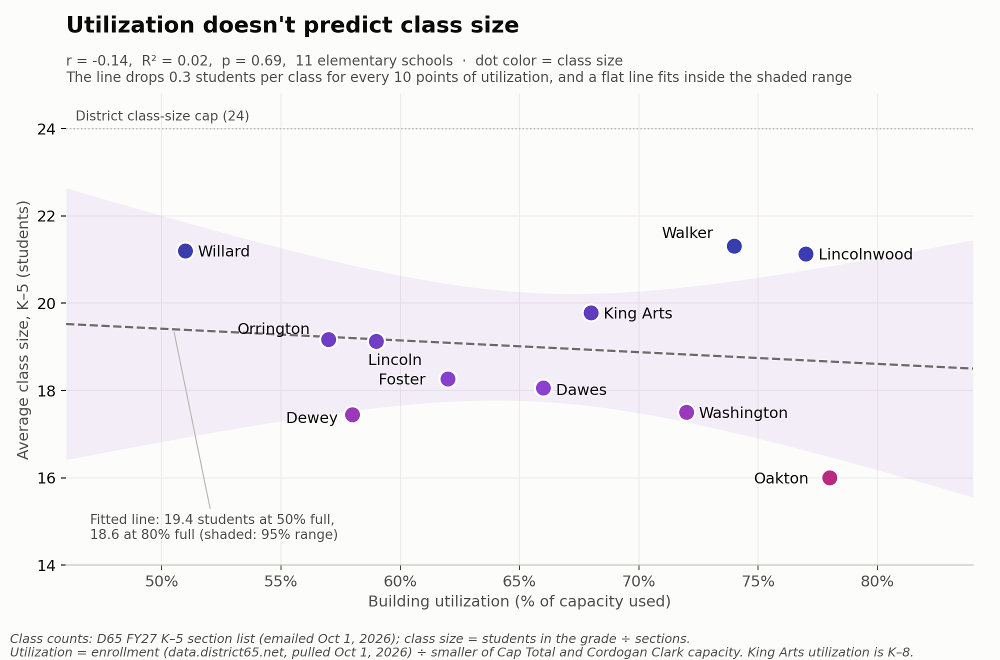
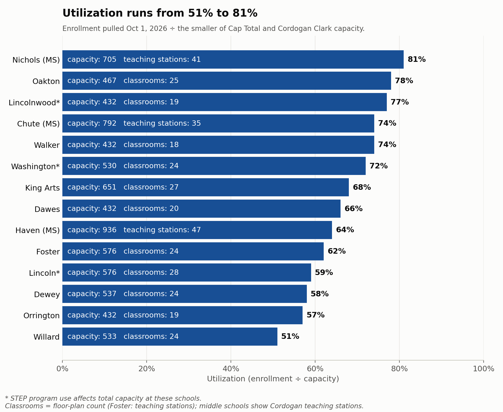
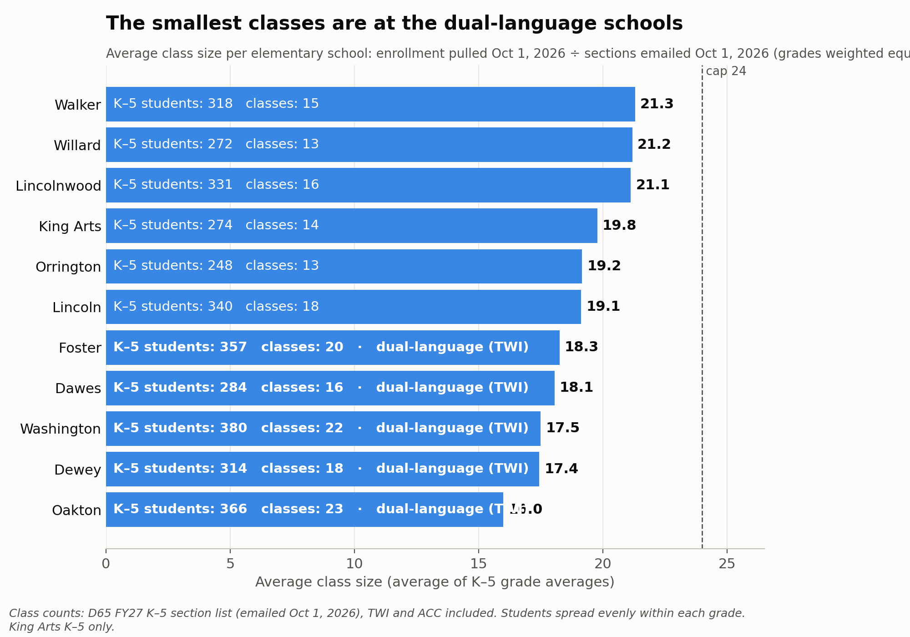
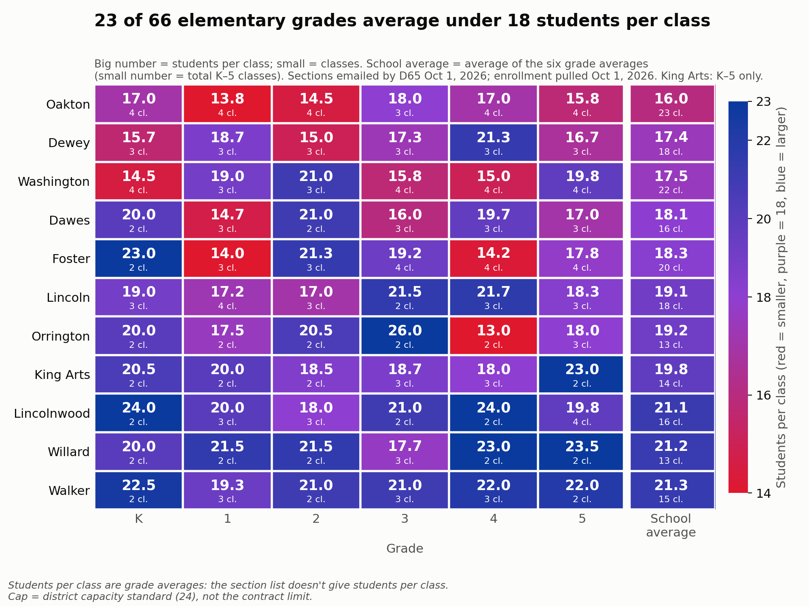

# SY27 Building Use, Class Size and Closure Costs (v2)

> **v2 data, all as of October 1, 2026.**
> - **Class counts:** the district's FY27 (fall 2026) K–5 section list, a spreadsheet (`k5_sections_fy27.xlsx`) received by email from District 65 on October 1, 2026: 188 sections by school, grade and program (TWI, monolingual, ACC). It replaces our estimated class counts (190).
> - **Enrollment:** re-pulled from the district dashboard, [data.district65.net](https://data.district65.net){:target="_blank"}, on October 1, 2026: 5,415 students (5,462 on the September 23 pull).
> - **Class sizes are grade averages** (students in the grade ÷ sections), because the section list doesn't give students per class.
> - The busing and building-savings section below is unchanged from v1.

## Summary: savings need to work with the district we have

District 65 faces a financial crisis that is both immediate and far-reaching: the district is looking to cut about 10% of its budget, roughly $20 million. A solution needs to account for the long time horizon while also producing savings in the short term. The Nerds' goal is to provide insight and data analysis to inform decision making.

- **School closures are being treated as the primary lever, but each one saves less than it appears.** After added busing, closing one school nets roughly $0.2–0.7M a year, about 1–3.5% of the $20 million target. Closing two schools would still come to only about 2–7% of the target. Busing takes back 20–35% of the building savings ([details](#closing-schools-busing-costs-vs-building-savings)). That's before moving and renovation costs, which come first.
- **Closing too many schools can raise costs in both the short and long term,** through added transportation and moving costs and potential renovations needed to accommodate programs. (See [Closing schools: busing costs vs. building savings](#closing-schools-busing-costs-vs-building-savings).)
- **Staff time and labor are not being counted.** Much of the budget challenge comes from staffing. Closures focus administrators on problems whose gains are mostly long-term, and pull attention away from the larger short-term savings available through staffing.

Closing buildings may be one way to address the budget gap, but **solving for high utilization is not the answer.** Across 11 elementary schools, utilization explains about 2% of the difference in class size (r = −0.14), and that holds when any one school is left out (finding 1 below). Any plan has to work with the buildings we have, not an idealized version of an imagined district.

- **Some of the lowest utilization is in larger buildings.** Lincoln, for example, is at 59% of a 576-seat capacity (October 1). Instead of focusing only on the utilization rate, the district could look at other good uses for the space, such as partnering with a local preschool.
- **The smallest classes are at the schools with dual-language (TWI) programs** (finding 3 below). Paradoxically, TWI programs are hard to get into, yet have smaller classes in the upper grades, through attrition and the design of the program. The district could allow more strands in K–2 and then consider consolidating strands in grades 4–5.

**Additional or alternative strategies that could be pursued at the same time.** Closures alone won't reach the $20 million target, so these could run alongside them:

- **Creative building use:** lease or share underused space, for example with a preschool or community partner, instead of judging buildings on utilization alone.
- **Voluntary retirement incentives, negotiated with the teachers' union:** encouraging eligible staff to retire, based on years of service, can reduce costs through attrition instead of layoffs, and help the district keep a stable, high-quality teaching staff going forward.
- **Opening TWI to nearby communities for tuition, if possible:** filling open dual-language seats with tuition-paying students from outside the district would bring in revenue and fill small upper-grade classes.

The district may or may not need to close buildings, but its plan for savings has to account for the unique nature of our district and its buildings. Otherwise the short- and medium-term savings, the ones we need most, can evaporate.

**What any savings plan should include:**

1. **Itemized savings from the Kingsley and Bessie Rhodes closures:** what was actually saved, by category, net of the costs of opening Foster.
2. **The full cost of closing and relocating a school:** direct costs (moving, packing, IT, closing the building), plus the staff and community time the process takes.
3. **Expected renovation costs at receiving schools** to house the programs that move there, such as TWI, STEP and special education.
4. **The specific position categories to be cut and the savings from each:** for example, administration, building staff, classroom teachers, specialists and support staff.
5. **The impact on class size:** how many classes each affected grade would run before and after, and the resulting class sizes, not just building utilization.
6. **A forward-looking case:** how the plan puts the district on sound financial footing for the long term, and how it will improve educational outcomes for all students, not just how it closes this year's gap.

We need to work with the buildings and the district we have: chasing an artificially high utilization rate can lead to ballooning, persistent cost increases. We are excited by the direction things are heading, and we look forward to hearing the vision for D65's future.

<b>More on data: How District 65's buildings are used this fall: utilization, class sizes, and what closing a school saves once added busing is counted. </b>
 **Current data** is from the district's public dashboard, [data.district65.net](https://data.district65.net){:target="_blank"}, pulled October 1, 2026 (fall of school year 2026–27, "SY27"; first pulled September 23), and scraped by a Legion member ([source files](https://github.com/jmclip/enrollment_fall26){:target="_blank"}). **Class counts** are the district's FY27 K–5 section list, received by email on October 1, 2026. **Planning data** is from the district's utilization and capacity tables and Cordogan Clark's February 2022 capacity study. 

**Help with accuracy:** if you know actual class sizes at your school, please add them through the [crowdsourcing form](https://docs.google.com/forms/d/e/1FAIpQLSepZPKRXOA8HTbEoWf8sUmXK_UlhWkK4_6y4cl9NQLNEYL1Bw/viewform?usp=dialog){:target="_blank"}.

## Key findings

### 1. High-utilization buildings don't have bigger classes: utilization and class size are unrelated

Each dot is an elementary school: utilization against average class size (enrollment and sections as of October 1, 2026), colored like the heatmap below (red = smaller classes, blue = larger). The dashed line is a least-squares fit; the shaded band is its 95% confidence range. The y-axis runs up to the district's class-size cap of 24, so the slope is shown at its real size.

- **The line tilts slightly down, and that tilt is noise.** Class size drops about 0.3 students for every 10 points of utilization: 19.4 at a 50%-full building, 18.6 at 80% (r = −0.14, R² = 0.02, p = 0.69, 11 schools). A flat line, or one tilting up, fits inside the shaded band just as well. Utilization explains about 2% of the difference in class size between schools.
- **The two extremes point opposite ways.** Oakton has the highest utilization (78%) and the smallest classes (16.0). Willard has the lowest utilization (51%) and among the largest classes (21.2).
- **What drives class size instead:** how each grade divides into classes, and programs (TWI, ACC) that add classes. A building with low utilization can still have full classrooms, and a building with high utilization can have small ones.
- **The result doesn't depend on any one school.** Leaving out each school in turn, the correlation stays between −0.37 and +0.17, and no version is statistically significant (every p ≥ 0.29).

<b>Show the leave-one-out check</b>: the correlation recomputed 11 times, each time without one school

| School left out | Its utilization | Its class size | r | R² | Slope | p |
|---|---:|---:|---:|---:|---:|---:|
| *None (all 11)* | | | **−0.14** | 0.02 | −0.027 | 0.69 |
| Dawes | 66% | 18.1 | −0.14 | 0.02 | −0.026 | 0.70 |
| Dewey | 58% | 17.4 | −0.24 | 0.06 | −0.047 | 0.50 |
| Foster | 62% | 18.3 | −0.16 | 0.03 | −0.031 | 0.66 |
| King Arts | 68% | 19.8 | −0.15 | 0.02 | −0.030 | 0.67 |
| Lincoln | 59% | 19.1 | −0.14 | 0.02 | −0.027 | 0.71 |
| Lincolnwood | 77% | 21.1 | −0.37 | 0.14 | −0.073 | 0.29 |
| Oakton | 78% | 16.0 | +0.17 | 0.03 | +0.030 | 0.64 |
| Orrington | 57% | 19.2 | −0.14 | 0.02 | −0.028 | 0.71 |
| Walker | 74% | 21.3 | −0.32 | 0.10 | −0.059 | 0.37 |
| Washington | 72% | 17.5 | −0.08 | 0.01 | −0.015 | 0.83 |
| Willard | 51% | 21.2 | +0.12 | 0.01 | +0.024 | 0.75 |

*Slope = change in average class size per percentage point of utilization. Only dropping Oakton or Willard flips the sign, and only to about +0.1 to +0.2. A rank-based (Spearman) correlation gives the same picture: −0.35 to +0.18.*

### 2. Utilization runs from 51% to 81%

Utilization = enrollment (pulled October 1, 2026) ÷ capacity (the smaller of the district's Cap Total and Cordogan Clark's capacity).

- **STEP (\*)** program use reduces usable capacity at Lincoln, Lincolnwood and Washington.

### 3. The smallest classes are at the dual-language schools

Average class size per school (average of its K–5 grades; King Arts K–5 only), as of October 1, 2026.

- **The five smallest averages are the five TWI schools:** Oakton 16.0, Dewey 17.4, Washington 17.5, Dawes 18.1 and Foster 18.3.
- **TWI schools average 17.5 students per class; the other schools average 20.3.** Each strand adds its own class at every grade, whether or not it's full.
- **The largest classes are at schools with no programs:** Walker (21.3), Willard (21.2) and Lincolnwood (21.1).

*Class counts are the district's FY27 K–5 sections (spreadsheet emailed October 1, 2026), including TWI and ACC sections. Class size = students in the grade ÷ sections. The full math is in the class-size section below.*

### 4. A third of elementary grades average under 18 students per class

Red is small classes, purple is about 18, and blue is large (up to the 24 cap). The last column is each school's average.

- **23 of the 66 school-grades are under 18.** They are concentrated at Oakton (5 of 6 grades), Dewey (4), and Dawes, Foster and Washington (3 each).
- **Small grades split awkwardly.** Orrington's 4th grade has 26 students in 2 classes (13 each). A 25th student forces a second class.
- **One grade is over the 24 cap.** The section list shows Orrington's 3rd grade with 52 students in 2 sections, an average of 26. That's worth confirming with the district: either the grade runs above the cap or a section is missing from the list.
- **Walker, Willard and Lincolnwood are blue almost everywhere.**

## Class-size math by school

<b>Show the class-size math</b>: students ÷ classes for every school and grade, the Oakton note, and the parent-report check

Students in the grade (pulled October 1, 2026) ÷ sections (district list, emailed October 1, 2026) = average class size (elementary, King Arts K–5 only).

| School | K | 1 | 2 | 3 | 4 | 5 | Avg | Program classes per grade |
|---|---:|---:|---:|---:|---:|---:|---:|---|
| Walker | 45 ÷ 2 = **22.5** | 58 ÷ 3 = **19.3** | 42 ÷ 2 = **21.0** | 63 ÷ 3 = **21.0** | 66 ÷ 3 = **22.0** | 44 ÷ 2 = **22.0** | **21.3** | – |
| Willard | 40 ÷ 2 = **20.0** | 43 ÷ 2 = **21.5** | 43 ÷ 2 = **21.5** | 53 ÷ 3 = **17.7** | 46 ÷ 2 = **23.0** | 47 ÷ 2 = **23.5** | **21.2** | – |
| Lincolnwood | 48 ÷ 2 = **24.0** | 60 ÷ 3 = **20.0** | 54 ÷ 3 = **18.0** | 42 ÷ 2 = **21.0** | 48 ÷ 2 = **24.0** | 79 ÷ 4 = **19.8** | **21.1** | – |
| King Arts | 41 ÷ 2 = **20.5** | 40 ÷ 2 = **20.0** | 37 ÷ 2 = **18.5** | 56 ÷ 3 = **18.7** | 54 ÷ 3 = **18.0** | 46 ÷ 2 = **23.0** | **19.8** | – |
| Orrington | 40 ÷ 2 = **20.0** | 35 ÷ 2 = **17.5** | 41 ÷ 2 = **20.5** | 52 ÷ 2 = **26.0** | 26 ÷ 2 = **13.0** | 54 ÷ 3 = **18.0** | **19.2** | – |
| Lincoln | 57 ÷ 3 = **19.0** | 69 ÷ 4 = **17.2** | 51 ÷ 3 = **17.0** | 43 ÷ 2 = **21.5** | 65 ÷ 3 = **21.7** | 55 ÷ 3 = **18.3** | **19.1** | – |
| Foster | 46 ÷ 2 = **23.0** | 42 ÷ 3 = **14.0** | 64 ÷ 3 = **21.3** | 77 ÷ 4 = **19.2** | 57 ÷ 4 = **14.2** | 71 ÷ 4 = **17.8** | **18.3** | 2 TWI (K: 1) |
| Dawes | 40 ÷ 2 = **20.0** | 44 ÷ 3 = **14.7** | 42 ÷ 2 = **21.0** | 48 ÷ 3 = **16.0** | 59 ÷ 3 = **19.7** | 51 ÷ 3 = **17.0** | **18.1** | 1 TWI |
| Washington | 58 ÷ 4 = **14.5** | 57 ÷ 3 = **19.0** | 63 ÷ 3 = **21.0** | 63 ÷ 4 = **15.8** | 60 ÷ 4 = **15.0** | 79 ÷ 4 = **19.8** | **17.5** | 2 TWI (5th: 4 TWI, no monolingual) |
| Dewey | 47 ÷ 3 = **15.7** | 56 ÷ 3 = **18.7** | 45 ÷ 3 = **15.0** | 52 ÷ 3 = **17.3** | 64 ÷ 3 = **21.3** | 50 ÷ 3 = **16.7** | **17.4** | 1 TWI |
| Oakton | 68 ÷ 4 = **17.0** | 55 ÷ 4 = **13.8** | 58 ÷ 4 = **14.5** | 54 ÷ 3 = **18.0** | 68 ÷ 4 = **17.0** | 63 ÷ 4 = **15.8** | **16.0** | 1 TWI + 1 ACC |

*Each cell shows students in that grade ÷ sections = average class size. "Avg" is the average of the six grade averages. "Program classes per grade" lists the TWI and ACC sections in each grade's count; the rest are monolingual. Students per class are averages across all of a grade's sections, since the section list doesn't give students per class. Full detail: `class_size_detail_by_school_v2.csv`. Differences from our v1 estimates: Foster K (2 sections, not 3), 2nd (3, not 4) and 4th (4, not 3); Oakton 3rd (3, not 4) and 5th (4, not 3); Orrington 3rd (2, not 3).*

**Note on Oakton.** The district's section list confirms one TWI and one ACC section in every grade K–5. Oakton runs 4 sections in every grade except 3rd (3). Parents had reported 3 classes in 5th grade; the district's list shows 4 (1 TWI, 1 ACC, 2 monolingual).

**Checked against parent reports (as of 2026-09-24).** Parents reported 11 actual classes through the [crowdsourcing form](https://docs.google.com/forms/d/e/1FAIpQLSepZPKRXOA8HTbEoWf8sUmXK_UlhWkK4_6y4cl9NQLNEYL1Bw/viewform?usp=dialog). Ten were reported with confidence 4–5 out of 5 and a named source (the teacher, a conference, a class email list, the PTA or a child in the class). These are still second-hand reports, not district data. The source notebook (section 12) compares each report with the estimate above.

| School | Grades reported | Classes reported | Result |
|---|---|---:|---|
| Willard | K, 1, 2, 3, 4, 5 | 8 | **All 8 match the estimate within 2 students.** In grades 1 and 2 every class was reported: 1st grade 22 + 21 = 43, the same as the dashboard's 43. 2nd grade 22 + 21 = 43, against 44 on the dashboard (one parent gave a grade total of 42). |
| Washington | 2, 5 | 3 | **2nd grade matches; 5th grade is 3 above.** 2nd grade: a monolingual/mainstream class of 23 and a TWI class of 19, against an estimate of 21.0 (63 students in 3 classes). The district's section list confirms Washington's reported class counts: 4 per grade, 3 in 1st and 2nd. 5th grade (79 students on October 1, 4 sections, all listed as TWI) is departmental, with reported classes of 23 against our 20.2. |

**Class counts are now verified** against the district's section list (emailed October 1, 2026). Class *sizes* are still grade averages; parent reports remain the only check on individual classes. Parent reports were compared with the September 23 enrollment. Details: [`class_size_parent_check.csv`](https://github.com/jmclip/enrollment_fall26/blob/main/data/class_size_parent_check.csv).

## Closing schools: busing costs vs. building savings

Closing a school saves building costs, but some of its students then need a bus. **For a typical closure, added busing takes back roughly a fifth to a third of the building savings.** Closures still save money, but less than building costs alone suggest.

This estimate uses the district's transportation data from the Structural Deficit Reduction Plan (SDRP) closure scenarios on the [School Closure Hub](https://www.district65.net/about/budget-finance/structural-deficit-reduction-plan/phase-iii-school-closures-hub){:target="_blank"}. Those tables count students at every school by how they get there: bus, hazard route, program placement or walk, both today and under each closure scenario. Because we don't have current busing data, the estimate may count more bused students than there are in SY 2026-27.

| One school closed (typical) | Low | High |
|---|---:|---:|
| Building savings | $0.47M | $0.82M |
| Added busing | −$0.27M | −$0.15M |
| **Net savings** | **$0.20M** | **$0.67M** |

*Yearly. Net low = low savings minus high busing cost; net high = the reverse.*

**A typical closure adds about 120 general-education bus riders** (roughly 85 to 155, depending on the school), or one or two new bus routes.

**Most new riders are hazard riders**: students whose new walk crosses an unsafe route, not students who live more than 1.5 miles away. They cluster at one or two receiving schools, which keeps the number of new routes low.

**Building savings.** These are the costs that go away with the building:
- the principal ($181K with benefits, FY26 salary disclosure)
- one office position ($60K, assumed)
- about 2.5 custodians ($65K each, assumed)
- utilities (about $67K a year for a typical building, 2025)

The high end adds a librarian ($133K), an assistant principal ($160K) and a health clerk, but only if those positions are actually cut. None of these figures include savings from combining classes.

**Added busing.** The low end counts new double routes at about $90K each, each carrying about 110 riders over two runs. The high end uses the district's average cost per general-education rider: about $2,200 ($2.4M in general-ed routes ÷ 1,104 riders today). Costs are from the district's [Transportation Memo](https://ig.foiagras.com/api/public/chat/documents/15622/view){:target="_blank"} (Feb 9, 2026). Special-education busing doesn't change.

### What's not included

- One-time costs: moving, and renovating receiving schools, including space for TWI and STEP.
- Avoided capital and maintenance at closed buildings. This could be the largest saving.
- Families who leave the district, and changes in state funding.
- Crossing guards or route changes that could remove a hazard designation and the busing that goes with it.

Calculations (v2 class-size charts: [`build_building_use_sy27_v2.py`](https://github.com/d65-legionofnerds/d65-legionofnerds.github.io/blob/main/dataanalysis/build_building_use_sy27_v2.py){:target="_blank"}, inputs in [`data/sy27_fall_v2/`](https://github.com/d65-legionofnerds/d65-legionofnerds.github.io/tree/main/dataanalysis/data/sy27_fall_v2){:target="_blank"}; busing: [`build_building_use_sy27.py`](https://github.com/d65-legionofnerds/d65-legionofnerds.github.io/blob/main/dataanalysis/build_building_use_sy27.py){:target="_blank"}. Data: the district's SDRP transportation tables are in [`data/`](https://github.com/d65-legionofnerds/d65-legionofnerds.github.io/tree/main/dataanalysis/data){:target="_blank"}, with the result in [`data/sy27_fall/closure_transportation_summary.csv`](https://github.com/d65-legionofnerds/d65-legionofnerds.github.io/blob/main/dataanalysis/data/sy27_fall/closure_transportation_summary.csv){:target="_blank"}.

## Replication and technical details

<b>Show replication and technical details</b>: how the data was collected, how to refresh, methods and definitions, checks, and known limitations

### How the data was collected

- **Current data** comes from the district's public dashboard, [data.district65.net](https://data.district65.net), a Plotly Dash app. Its charts come from requests to `/_dash-update-component`.
- **The pulls (2026-09-23, and again 2026-10-01 for v2):** those same requests were made for the district as a whole and for each of the 14 schools (Home, Attendance, Discipline, and all five assessments), plus every building's utility data. The chart data was decoded into the tidy CSVs in the [source repo](https://github.com/jmclip/enrollment_fall26).
- **Checks:** every school had to add up to the district totals (October 1: 5,415 students, 943 with IEPs, 1,428 incidents; every school's IEP pie matched its enrollment). The dashboard's filter is shared between visitors, so each school was also checked for internal consistency.
- **Planning data** comes from two district tables (typed in from screenshots) and Cordogan Clark's February 2022 capacity report (PDF). See [`sources/sources.md`](https://github.com/jmclip/enrollment_fall26/blob/main/sources/sources.md).

Full replication details, the endpoints and the scraper are in **[`scraping/README.md`](https://github.com/jmclip/enrollment_fall26/blob/main/scraping/README.md)**.

### How to refresh

1. In the [source repo](https://github.com/jmclip/enrollment_fall26): run `scraping/d65_scrape.py` to pull the dashboard again, then run `d65_enrollment_by_building.ipynb` top to bottom. The notebook estimates classes and writes the CSVs.
2. Copy `class_size_detail_by_school.csv`, `utilization_current_vs_predicted.csv`, `capacity_comparison.csv` and `twi_strands.csv` into `dataanalysis/data/sy27_fall_v2/` here. For v2, class sizes come from `class_size_v2.py` in the source repo, which divides the dashboard enrollment by the district's section list.
3. Run `python3 dataanalysis/build_building_use_sy27_v2.py` (needs pandas, matplotlib and scipy). It redraws the four `_v2` charts in `assets/` and the leave-one-out table. The busing tables need the SDRP 1A/2FR/2DR files; without them the script reuses the v1 busing result.

The dashboard stores filtered results in one shared spot on its server, so another visitor filtering at the same moment can mix up numbers. The scraper re-runs any school whose totals don't add up, and checks that schools sum to the district.

### Methods and definitions

| Term | Definition |
|---|---|
| **Current enrollment** | Dashboard enrollment, fall SY27 |
| **Projected enrollment** | "Enroll Total" in the district tables, a district projection. The elementary projections come from the Cordogan table; Chute, Haven and Nichols from the 1A table |
| **Cap Total** | District baseline capacity = 24 × calculated teaching stations |
| **Capacity used** | The smaller of Cap Total and Cordogan Clark capacity. Middle schools' Cordogan capacity comes from the report (PDF); their Cap Total and projections come from the 1A table |
| **Capacity goal** | Cordogan Clark's target utilization: 85% elementary, 80% middle, 75% Park/Rhodes/King Arts, 90% JEH (in `cordogan_clark_2022_report.csv`) |
| **Utilization** | Enrollment ÷ capacity used. Predicted utilization = projected enrollment ÷ Cap Total, as the district computed it |
| **STEP (\*)** | STEP program use affects total capacity at Lincoln, Lincolnwood and Washington |
| **Classrooms** | The district's floor-plan classroom count (capacity screenshot). Foster uses its teaching-station count because its floor-plan figure is blank. Middle schools have no floor-plan count; charts show their Cordogan teaching stations |
| **Building square feet** | (Electric + gas MMBtu) × 1,000 ÷ EUI (kBtu per sq ft), using 2025. 2018 gives the same result within about 25 sq ft. Accurate to roughly ± a few hundred sq ft |
| **Learning space** | Cordogan "Total SF Core Classrooms + SPED" (plus science labs at middle schools) ÷ building square feet |
| **Area capture** | Current enrollment ÷ students living in the attendance area ("Area Counts"). The neighborhood version subtracts TWI students, so it undercounts at TWI schools, since some TWI students live nearby |
| **Utility cost** | Electric, gas and water, calendar 2025, the last full year. Cost per student uses fall SY27 enrollment |
| **TWI strand** | One dual-language class per grade K–5 (6 rooms, 144 seats). TWE/TWS = English/Spanish-dominant; TWX as labeled by the district (meaning not confirmed) |

#### Class sizes (v2)

- **Sections:** the district's FY27 (fall 2026) K–5 section list, a spreadsheet received by email from District 65 on October 1, 2026 (`data/k5_sections_fy27.xlsx`). One row per section with its program (TWI, monolingual, African-Centered Curriculum); 188 sections across 11 schools.
- **Students:** enrollment by school and grade from data.district65.net, pulled October 1, 2026 (`data/dashboard_2026-10-01/`).
- **Class size:** students in the grade ÷ sections in the grade. The section list has no student counts, so TWI, ACC and monolingual classes in a grade are treated as the same size.
- **Cap = 24:** the district's capacity standard, used only for reference lines.
- **v1 (for comparison):** estimated sections as the fewest monolingual classes at 24 per class plus one class per TWI strand and ACC, with Washington and Oakton 5th grade from parent reports, on the September 23 enrollment. v1 matched the section list's totals for 9 of 11 schools.
- **Middle schools:** not in the section list; excluded from the elementary summaries, and King Arts counts K–5 only.

### Checks

- School enrollments, IEP counts and incidents add up to district totals (October 1, 2026: 5,415 / 943 / 1,428; September 23: 5,462 / 953 / 968).
- Every grade's school enrollments add up to the district total for that grade.
- Transcribed tables: parts add up to Enroll Total, and every Util % and Cordogan Delta recomputes.
- The capacity screenshot's Cordogan figures (square feet, teaching stations, capacity) match Cordogan Clark's February 2022 report for all 11 schools it covers. The notebook asserts this on every run.
- Transcriptions were checked byte for byte (checksums) when moving the dashboard data.

### Known limitations and data to request

- **Class sizes are grade averages.** The district's section list (October 1, 2026) gives sections but not students per section.
- **TWI by grade:** needed to model the dual-language scenarios room by room.
- **Current ACC enrollment at Oakton:** the model uses the 73 projected.
- **Middle schools:** the Cordogan report gives their teaching stations, capacity and classroom square feet, but there's no floor-plan classroom count, so they're left out of the classrooms-needed comparison.
- **Foster:** has no utility account on the dashboard, so there's no square footage or cost for it.
- **Classroom counts** may include art, music or library rooms, so spare-room figures are upper bounds.
- **The dashboard's shared filter** can cross results between visitors; see How to refresh.
- **[`scraping/d65_scrape.py`](https://github.com/jmclip/enrollment_fall26/blob/main/scraping/d65_scrape.py) hasn't been run end to end against the live site.** The first pull went through a browser, and the script's chart-decoding code was tested against real responses. Expect small fixes on its first run.

See [`sources/sources.md`](https://github.com/jmclip/enrollment_fall26/blob/main/sources/sources.md) for where each number comes from.

---

*Made with help from Claude (an AI model), which can make mistakes, including in transcribing data, in calculations and in interpretation. Please verify figures against the sources before relying on them.*
