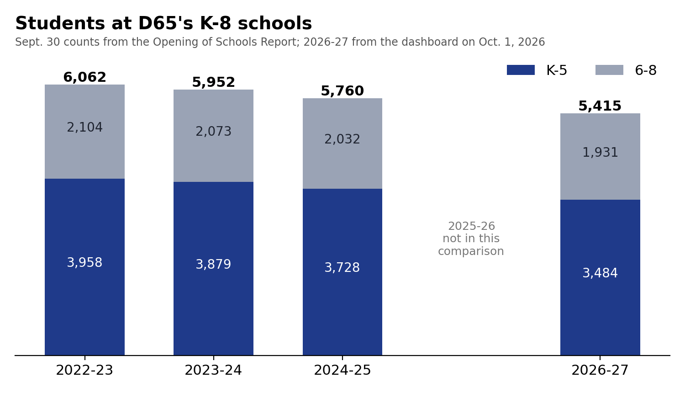
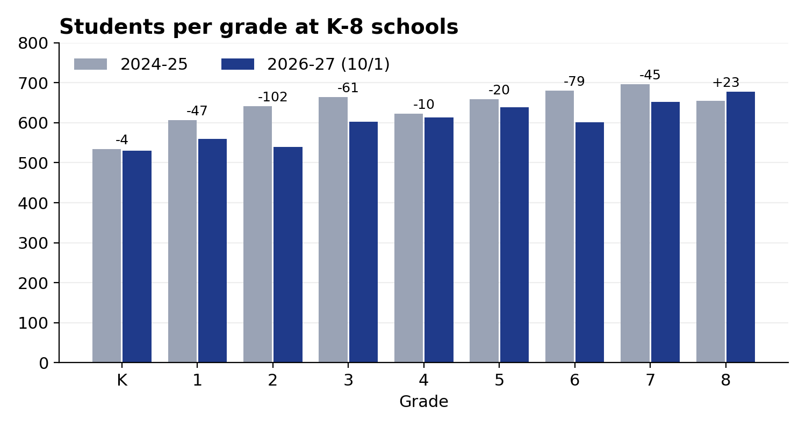
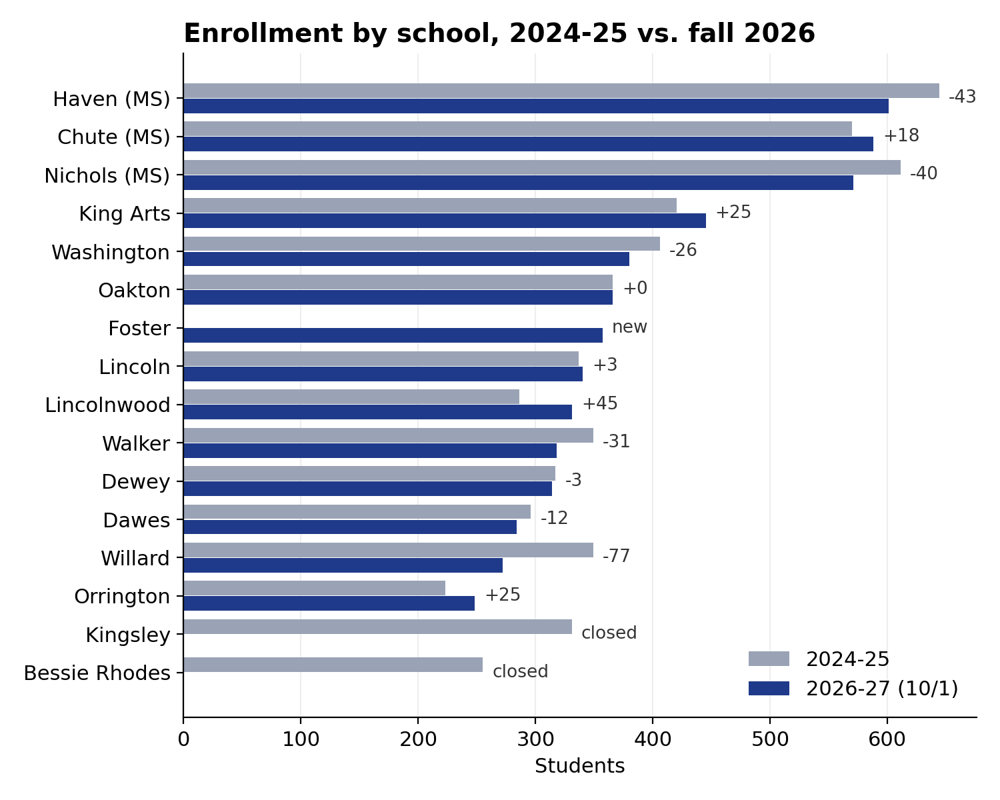
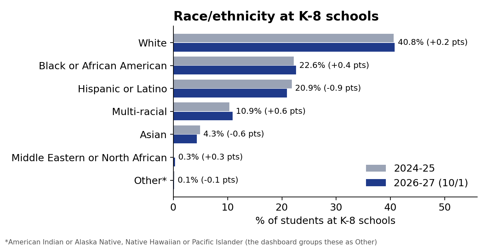

# Opening of Schools: 2024-25 and earlier vs. fall 2026

District 65 publishes an **Opening of Schools Report** each January with enrollment and program counts as of Sept. 30. This folder pulls every table out of the [2024-2025 report](https://resources.finalsite.net/images/v1738077970/district65net/vw6lsh1di6lqoeyhkv2a/OpeningofSchoolsReportSY24-25-FINAL.pdf) (January 2025, data as of Sept. 30, 2024; its across-years table also covers 2022-23 and 2023-24). It then compares them with **fall 2026 (SY 2026-27)**, using:

- the district dashboard, [data.district65.net](https://data.district65.net), **pulled October 1, 2026** (`../data/dashboard_2026-10-01/`), and
- the district's FY27 K-5 section list, **emailed by the district October 1, 2026** (`../data/k5_sections_fy27.xlsx`).

2025-26 isn't included yet. Adding the 2025-26 report would fill the gap.

**What's comparable.** The dashboard only covers D65's 14 K-8 schools, so every comparison below is limited to students at **K-8 schools** (elementary, middle and magnet schools). JEH / Family Center, Park, Rice and SEES are left out. Those are the same students as the report's "K-5 (excluding Park, Rice, SEES)" and "6-8" rows.

## Headline numbers

| | 2022-23 | 2023-24 | 2024-25 | 2026-27 (10/1) | Change since 2024-25 |
|---|---:|---:|---:|---:|---:|
| Students at K-8 schools | 6,062 | 5,952 | 5,760 | **5,415** | −345 (−6.0%) |
| K-5 | 3,958 | 3,879 | 3,728 | **3,484** | −244 (−6.5%) |
| 6-8 | 2,104 | 2,073 | 2,032 | **1,931** | −101 (−5.0%) |
| Kindergarten | 593 | 588 | 534 | **530** | −4 |
| K-5 TWI (TWE + TWS + TWX) | | | 740 (19.8% of K-5) | **683** (19.6%) | −57 |
| Students with IEPs at K-8 schools | | | 905 (15.7%) | **943** (17.4%) | +38 |
| EL students at K-8 schools | | | not by school | 761 (14.1%) | |

*Report figures are Sept. 30 counts. 2026-27 figures are the dashboard on Oct. 1, 2026. The report's district-wide K-5 TWI count (775) also includes 35 "Monitoring 2 yrs" students, a category the dashboard doesn't show. That leaves 740 for a like-for-like comparison.*

## What changed

**1. K-8 enrollment is down 345 students (6%) in two years, and 647 (11%) since 2022-23.** Two years later, every 2024-25 student in grades K-6 should now be in grades 2-8. The 345-student drop breaks down as:

- **−1,352:** the 2024-25 7th and 8th graders (697 + 655) have left for high school.
- **+1,089:** new kindergarten and 1st grade classes (530 + 559).
- **−82:** net change within the continuing grades.

So most of the drop comes from large classes leaving and smaller ones arriving, not from families leaving mid-way.

**2. Kindergarten has held steady at about 530** (534 in 2024-25, 530 now). It fell from 593 in 2022-23, so the smaller incoming classes are now working up through the grades.

| 2024-25 grade → 2026-27 grade | 2024-25 | 2026-27 | Change |
|---|---:|---:|---:|
| K → 2 | 534 | 540 | +6 |
| 1 → 3 | 606 | 603 | −3 |
| 2 → 4 | 642 | 613 | −29 |
| 3 → 5 | 664 | 639 | −25 |
| 4 → 6 | 623 | 601 | −22 |
| 5 → 7 | 659 | 652 | −7 |
| 6 → 8 | 680 | 678 | −2 |

Same students, two years later (K-8 schools only).

**3. By school, the closures and Foster dominate.** Kingsley (331) and Bessie Rhodes (255) closed after 2024-25, and Foster opened (357).

- **Largest losses:** Willard −77 (its TWI strand moved to Foster), Haven −43, Nichols −40 and Walker −31.
- **Largest gains:** Lincolnwood +45, King Arts +25, Orrington +25 and Chute +18.

**4. The racial and ethnic mix is almost unchanged.** No group's share moved more than 1 percentage point. In raw numbers, though, the decline is uneven:

- Asian students: −47 (−17%)
- Hispanic or Latino students: −125 (−10%)
- White students: −131 (−6%)
- Black students: −53 (−4%)
- Multi-racial students: −4 (−1%)

**5. More students have IEPs at K-8 schools: 943 (17.4%), up from 905 (15.7%), even with fewer students.**

- **Increases:** King Arts went from 84 to 123 (20% → 28% of its students), Washington from 62 to 78, Lincoln from 54 to 71, and Haven from 87 to 105.
- **Decreases:** Willard went from 66 to 30, and Orrington from 40 to 30.

Shifts this large at single schools suggest special-education programs moved. That's worth confirming with the district.

**6. TWI moved with the closures, and its share of K-5 is about the same.**

- **Where the strands went:** Bessie Rhodes (190 students) and Willard (98) no longer have TWI. Foster now has 198.
- **Totals:** TWE + TWS + TWX fell from 740 to 683. That's still about 20% of K-5.
- **Language mix:** Spanish-dominant (TWS) students fell from 325 to 236, while TWX rose from 103 to 157.

**7. Class sizes can't be compared directly.**

| | 2024-25 report | 2026-27 section list |
|---|---|---|
| K-2 | about 17 (goal ≤ 23) | 18.3 |
| 3-5 | about 18 (goal ≤ 25) | 18.7 |
| 6-8 | about 22 (goal ≤ 28) | not in the section list |

The report averages general-education core classrooms. The section list figure is all students in the grade ÷ sections (TWI and ACC included), so it runs a little higher by construction.

## Not available for fall 2026 yet

The dashboard doesn't report these, so they're 2024-25 and earlier only (all in `data/oos_2024_25/`):

- low income (2,483, 40%) and McKinney-Vento (215)
- ELL district-wide (1,020) and native languages
- transfers out of the attendance area (477)
- magnet school and ACC enrollment by attendance area
- school-age child care (464)
- transportation (1,574 bused)
- immunization (96.5%)
- pre-K experience of kindergarteners
- JEH / Family Center, Park, Rice and SEES counts

## Files

| File | Contents |
|---|---|
| `source/OpeningofSchoolsReportSY24-25-FINAL.pdf` | The report (SHA-256 `01216830b232ced0270e37de6e3d166e283c7a79268323578d044a6ec547ad94`), plus a text extract |
| `extract_oos_2024_25.py` | Reads every table with pdfplumber into `data/oos_2024_25/` and checks every total against the report |
| `data/oos_2024_25/` | One CSV per table: across-years, Tables A-D and 1-10 (Table 1 = school × grade × race, 127 rows). `_tables_index.csv` lists source pages |
| `compare_fall2026.py` | Builds the comparisons and charts |
| `data/compare/across_years_with_fall2026.csv` | The report's across-years table with a fall 2026 column ("not on dashboard" where there's no match) |
| `data/compare/enrollment_by_school.csv` | Each K-8 school, 2024-25 vs. 2026-27 |
| `data/compare/enrollment_by_grade.csv` | Each grade, same-grade and same-cohort changes |
| `data/compare/race_ethnicity_k8.csv` | Counts and shares |
| `data/compare/iep_by_school.csv`, `twi_by_school.csv`, `class_size_bands.csv` | IEP, TWI and class-size comparisons |
| `images/*.png` | The four charts above |

## Checks and caveats

- **Extraction checks:** every extracted table adds up to the report's totals. That covers 6,241 students; Table 1's rows and per-school sums; low income 2,483; IEP 1,213; TWI 775; transfers 477; magnet admissions 140; ACC 77; and child care 464.
- **Blank cells:** in Tables 2-10 the report leaves zero cells blank, and they're written as 0.
- **Dates and sources differ:** the report is the district's official Sept. 30 count, and fall 2026 is the dashboard on Oct. 1. Small differences in how each counts students (dual enrollment, mid-September moves) are possible.
- **Racial categories:** the dashboard groups American Indian or Alaska Native and Native Hawaiian or Pacific Islander as "Other". The comparison combines them the same way for 2024-25.
- **Moved programs:** IEP and TWI by school reflect programs that moved between buildings, not only changes in students.

*Made with help from Claude (an AI model), which can make mistakes, including in reading tables and in calculations. Please verify figures against the report and the dashboard before relying on them.*
